システムの振る舞いや業務プロセスを視覚化する手法として「アクティビティ図」があります。フローチャートと混同されがちですが、両者には明確な違いがあります。本記事では、アクティビティ図の基本から実践的な書き方、フローチャートとの違い、そしてLLMワークフローを題材にした実例まで詳しく解説します。

<!--truncate-->

## アクティビティ図とは

アクティビティ図（Activity Diagram）は、UML（統一モデリング言語）で定義されている行動図の一種です。システムやビジネスプロセスにおける**一連のアクティビティ（活動）の流れ**を視覚的に表現します。

### アクティビティ図の特徴

アクティビティ図は、以下の特徴を持ちます：

- **並行処理の表現**: フォーク（分岐）とジョイン（合流）で並列処理を明示
- **オブジェクトフローの表現**: データの流れを可視化
- **スイムレーン**: 責任の所在を明確に区分
- **例外処理**: 割り込みや例外フローの表現が可能
- **階層化**: 複雑な処理をサブアクティビティとして分割可能

以下は、シンプルなアクティビティ図の例です：

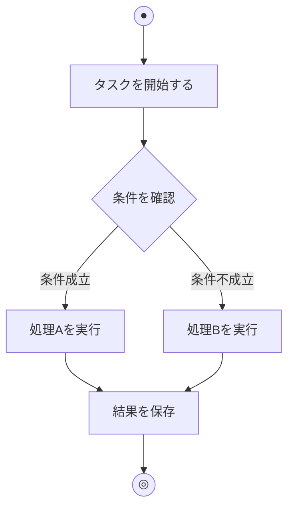

## フローチャートとアクティビティ図の違い

フローチャートとアクティビティ図は見た目が似ていますが、その目的と表現力に大きな違いがあります。

### 比較表

| 観点 | フローチャート | アクティビティ図 |
|------|--------------|----------------|
| **起源** | 1920年代〜（工業工学） | 1997年〜（UML） |
| **標準化** | ISO 5807、JIS X 0121 | UML 2.x（OMG標準） |
| **並行処理** | 表現困難 | フォーク/ジョインで明示的に表現 |
| **責任の分離** | 表現困難 | スイムレーンで明示 |
| **オブジェクト** | データの流れは限定的 | オブジェクトノードで明示 |
| **例外処理** | 条件分岐で表現 | 割り込み領域で明示的に表現 |
| **主な用途** | アルゴリズム、単純な処理 | 業務プロセス、システムの振る舞い |
| **粒度** | 詳細な処理ステップ | 抽象的なアクティビティ |

### 具体的な違い

#### 1. 並行処理の表現

**フローチャート**では、並行処理を明示的に表現する標準的な記号がありません。処理が順番に実行されることを前提としています。

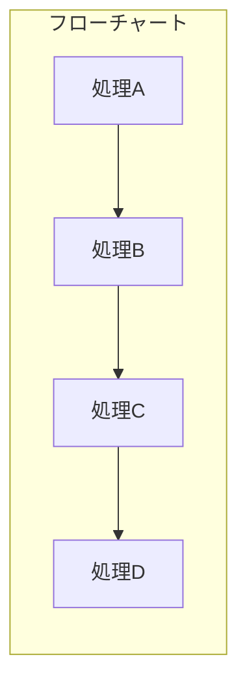

**アクティビティ図**では、**フォークバー**で処理を分岐させ、**ジョインバー**で合流させることで、並行処理を明確に表現できます。

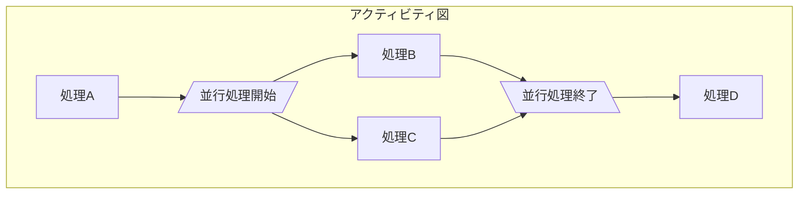

#### 2. 責任の分離（スイムレーン）

**フローチャート**では、誰がその処理を担当するかを図中に明示する標準的な方法がありません。

**アクティビティ図**では、**スイムレーン**（またはパーティション）を使って、各アクティビティの担当者・担当システムを視覚的に分離できます。

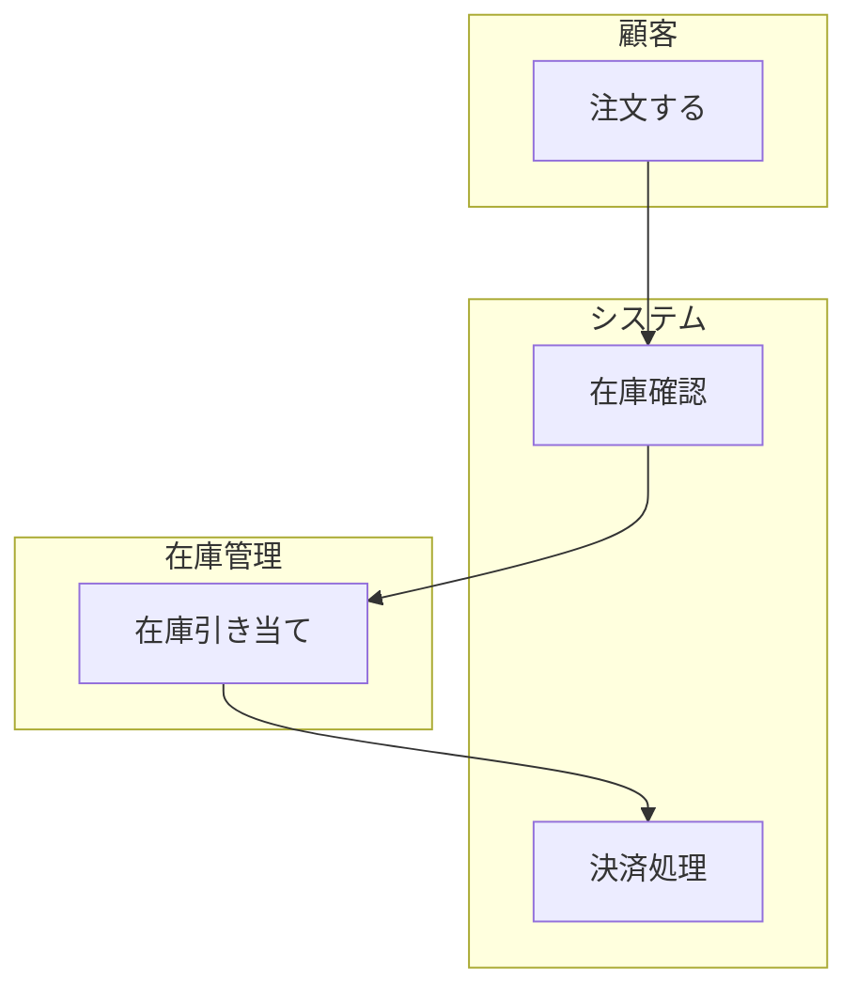

#### 3. オブジェクトフロー

**フローチャート**はデータの流れを表現することが主目的ではなく、処理の流れに焦点を当てています。

**アクティビティ図**では、**オブジェクトノード**を使って、アクティビティ間で受け渡されるデータや成果物を明示できます。

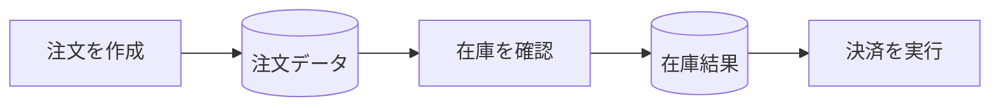

## アクティビティ図の基本要素

アクティビティ図を構成する主要な要素を解説します。

### 1. 開始ノード・終了ノード

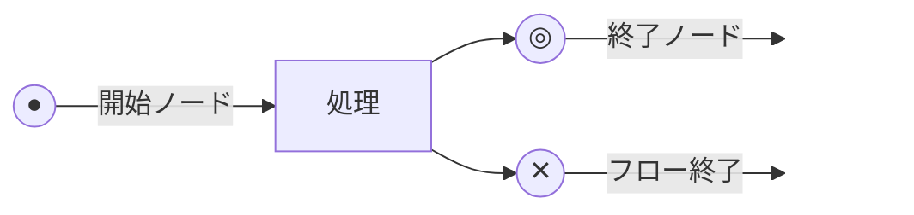

- **開始ノード（●）**: アクティビティの開始点。1つのダイアグラムに1つ
- **終了ノード（◎）**: アクティビティ全体の終了。すべてのフローが終了
- **フロー終了ノード（✕）**: 特定のフローのみ終了。他のフローは継続

### 2. アクションノード

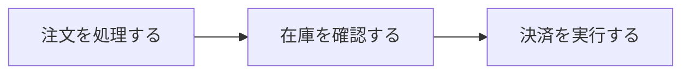

実際の処理・作業を表す角丸四角形です。動詞を使って「何をするか」を記述します。

### 3. 決定ノード・マージノード

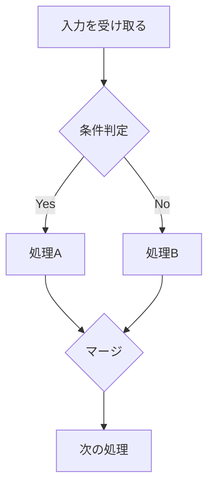

- **決定ノード**: ひし形で表し、条件によって処理を分岐
- **マージノード**: 複数のフローを1つに合流

### 4. フォーク・ジョイン（並行処理）

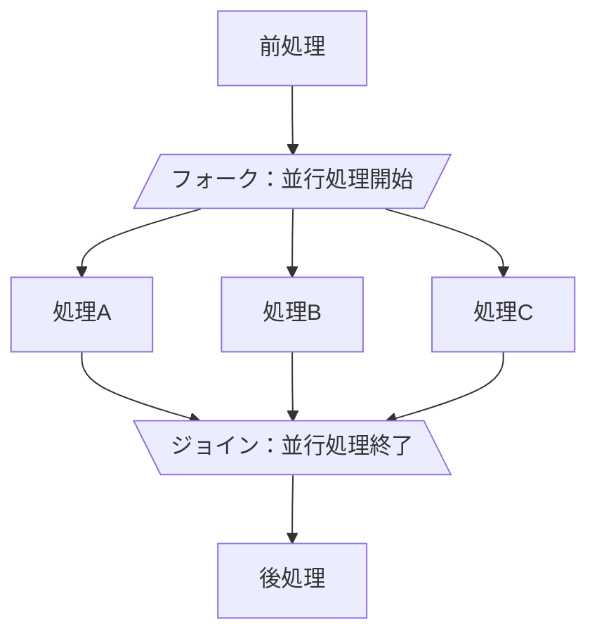

- **フォーク**: 1つのフローを複数の並行フローに分割
- **ジョイン**: 複数の並行フローを1つに合流（すべて完了を待つ）

### 5. スイムレーン（パーティション）

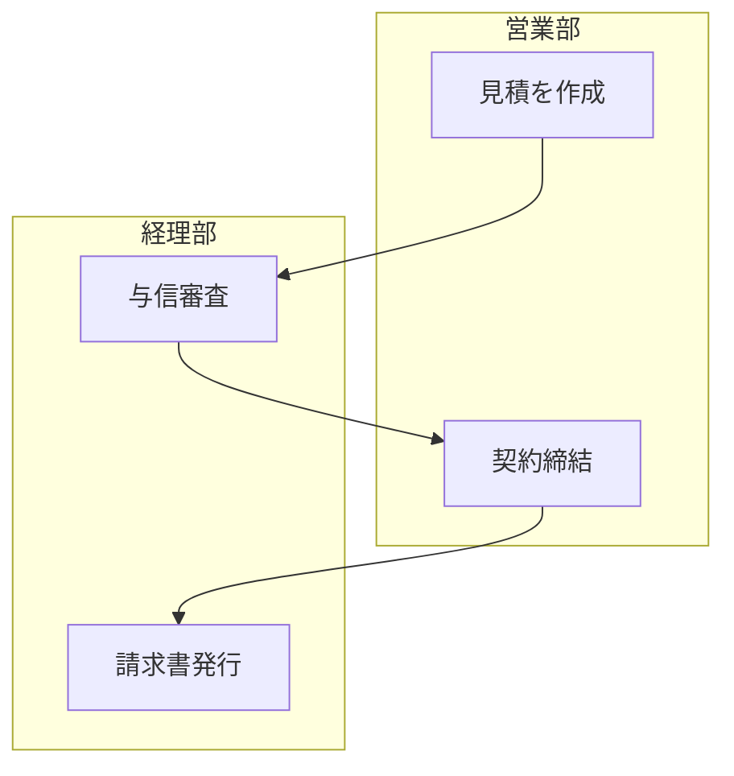

責任や役割ごとにアクティビティを分離して配置します。

### 6. オブジェクトノード（データフロー）

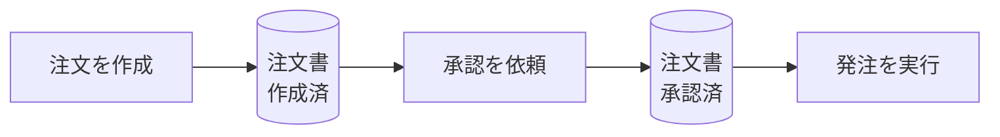

アクティビティ間で受け渡されるデータや成果物を表します。状態を示すことも可能です。

## 基本的なアクティビティ図の例

### 例1: シンプルな注文処理フロー

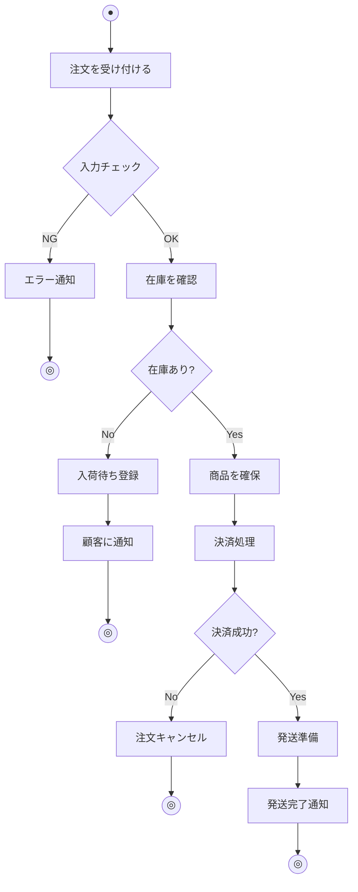

### 例2: 承認ワークフロー（スイムレーン付き）

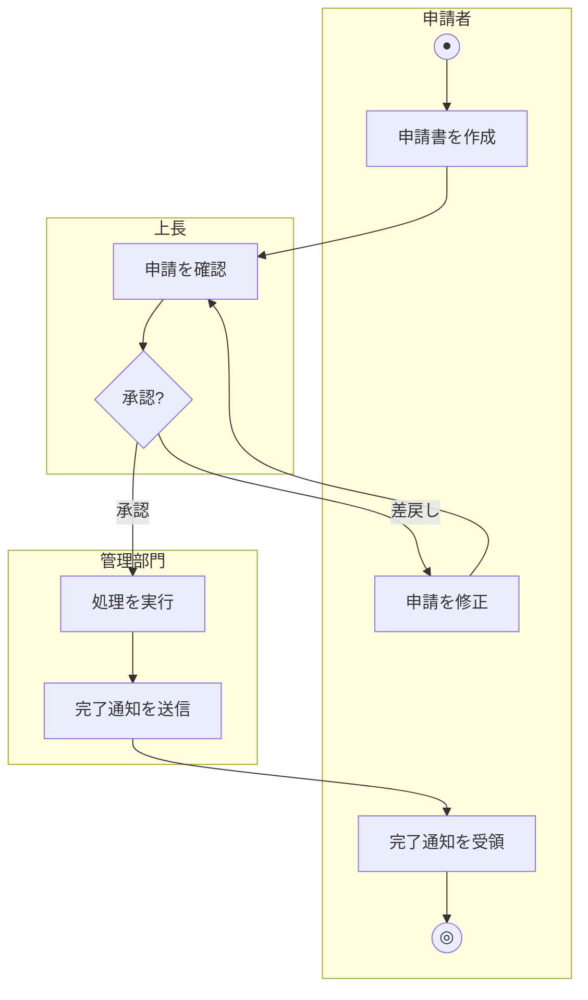

### 例3: 並行処理を含むデータ処理

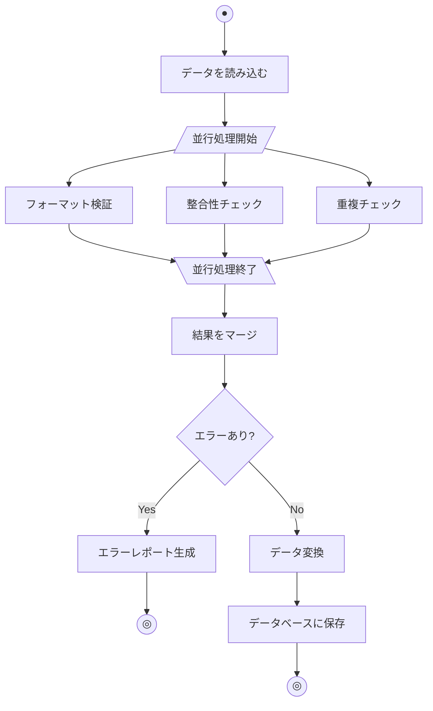

## LLMワークフローをアクティビティ図で表現する

ここからは、実際のLLM（大規模言語モデル）を活用したワークフローをアクティビティ図で表現してみます。

### ユースケース1: RAGベースの技術ドキュメントQ&Aシステム

社内の技術ドキュメントに対して自然言語で質問し、関連情報を検索して回答を生成するRAG（Retrieval-Augmented Generation）システムです。

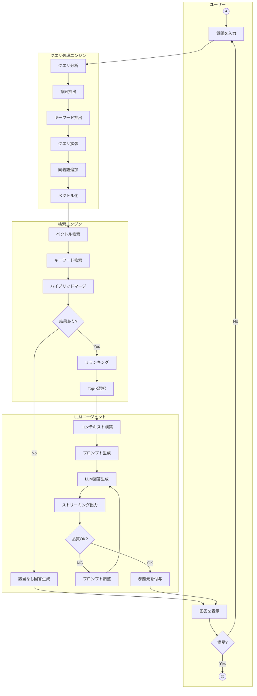

### ユースケース2: AIコードレビューエージェント

プルリクエストが作成されたときに自動でコードレビューを行うAIエージェントのワークフローです。

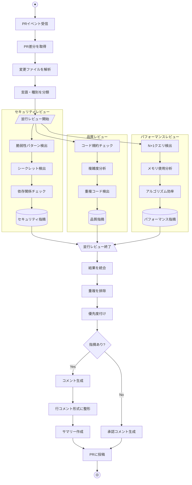

### ユースケース3: マルチエージェント文書作成システム

複数のAIエージェントが協調して技術文書を作成するワークフローです。

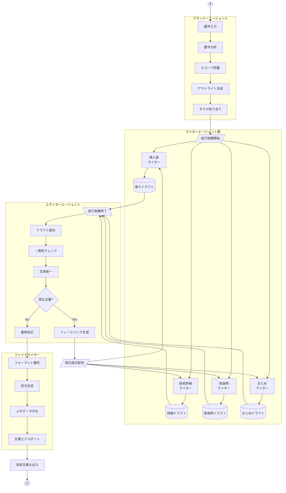

### ユースケース4: 自律型問題解決エージェント（ReActパターン）

LLMが自律的に思考・行動・観察を繰り返して問題を解決するReAct（Reasoning and Acting）パターンのワークフローです。

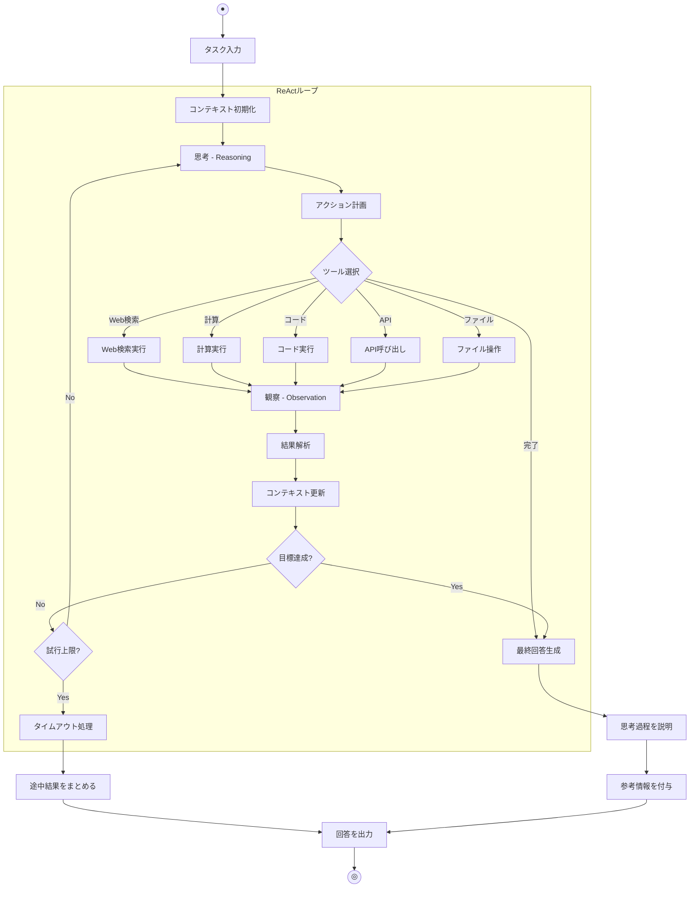

### ユースケース5: LLM評価パイプライン（LLM-as-Judge）

LLMの出力品質を別のLLMで評価するパイプラインです。

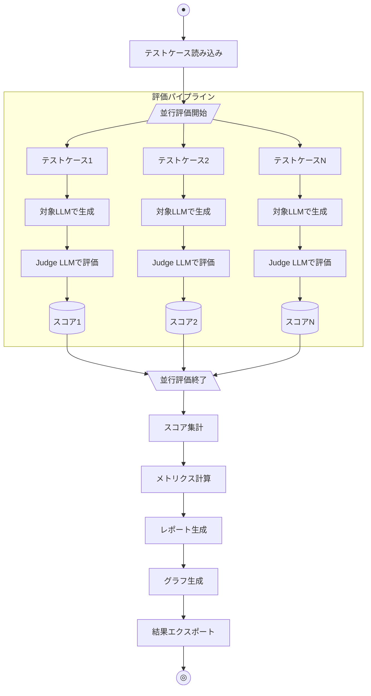

## アクティビティ図を書くときのベストプラクティス

### 1. 適切な抽象度を選ぶ

アクティビティは適切な粒度で記述します。細かすぎると複雑になり、粗すぎると意味がなくなります。

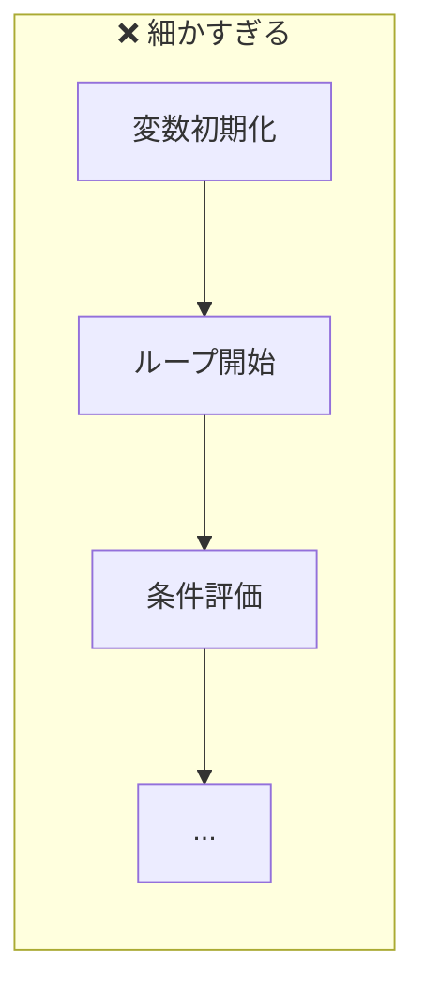

```mermaid
flowchart LR
    subgraph Good["✅ 適切な粒度"]
        B1[注文データ検証] --> B2[在庫確認] --> B3[決済処理]
    end
```

### 2. 動詞から始める命名

アクティビティ名は「何をするか」がわかるように動詞から始めます。

```mermaid
flowchart TB
    subgraph Bad["❌ 名詞のみ"]
        direction LR
        X1[注文] --> X2[在庫] --> X3[決済]
    end
    subgraph Good["✅ 動詞で開始"]
        direction LR
        Y1[注文を処理する] --> Y2[在庫を確認する] --> Y3[決済を実行する]
    end
```

### 3. スイムレーンで責任を明確に

責任の所在が重要な場合は、必ずスイムレーンを使って明確にします。

```mermaid
flowchart TB
    subgraph Frontend["フロントエンド"]
        A[リクエスト送信]
        E[レスポンス表示]
    end
    subgraph Backend["バックエンド"]
        B[リクエスト受信]
        C[ビジネスロジック実行]
        D[レスポンス返却]
    end

    A --> B --> C --> D --> E
```

### 4. 並行処理を明示する

処理が並行実行できる場合は、フォーク/ジョインを使って明示します。

```mermaid
flowchart TD
    A[データ受信] --> Fork[/ 並行処理 /]
    Fork --> B[検証処理]
    Fork --> C[ログ記録]
    Fork --> D[通知送信]
    B --> Join[\ 同期 \]
    C --> Join
    D --> Join
    Join --> E[完了処理]
```

### 5. 例外フローを忘れない

正常系だけでなく、エラー時やタイムアウト時のフローも記述します。

```mermaid
flowchart TD
    A[処理開始] --> B[外部API呼び出し]
    B --> C{成功?}
    C -->|Yes| D[結果を処理]
    C -->|No| E{リトライ可能?}
    E -->|Yes| F[待機してリトライ]
    F --> B
    E -->|No| G[エラーログ記録]
    G --> H[フォールバック処理]
    D --> I[完了]
    H --> I
```

## まとめ

アクティビティ図は、システムやビジネスプロセスの振る舞いを視覚化する強力なツールです。フローチャートと比較して、以下の点で優れています：

```mermaid
flowchart LR
    subgraph Advantages["アクティビティ図の利点"]
        A[並行処理を\nフォーク/ジョインで表現]
        B[責任の分離を\nスイムレーンで可視化]
        C[データの流れを\nオブジェクトノードで表現]
        D[UML標準に準拠]
    end
```

LLMを活用したシステムでは、複数のエージェントが並行して動作したり、思考・行動・観察のループが発生したりと、複雑なワークフローになりがちです。アクティビティ図を使うことで、これらの複雑な処理フローを明確に可視化し、チーム内での認識を揃えることができます。

フローチャートは単純なアルゴリズムの説明に、アクティビティ図は複雑なシステムの振る舞い記述に、それぞれ使い分けることで、より効果的なドキュメンテーションが実現できます。
