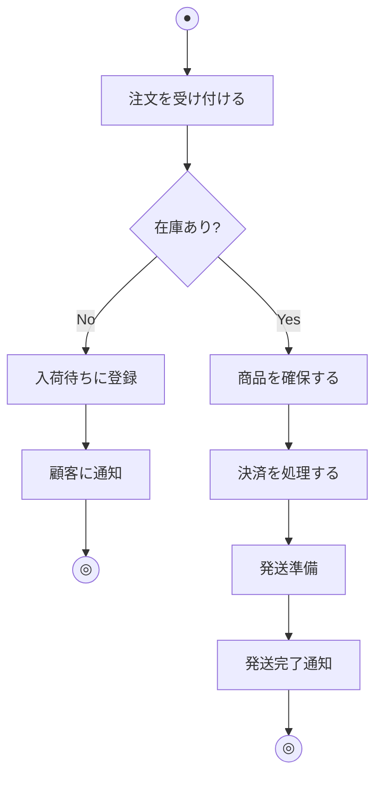
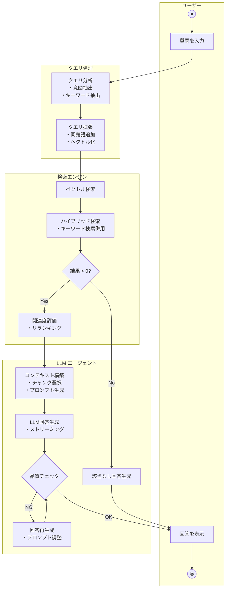
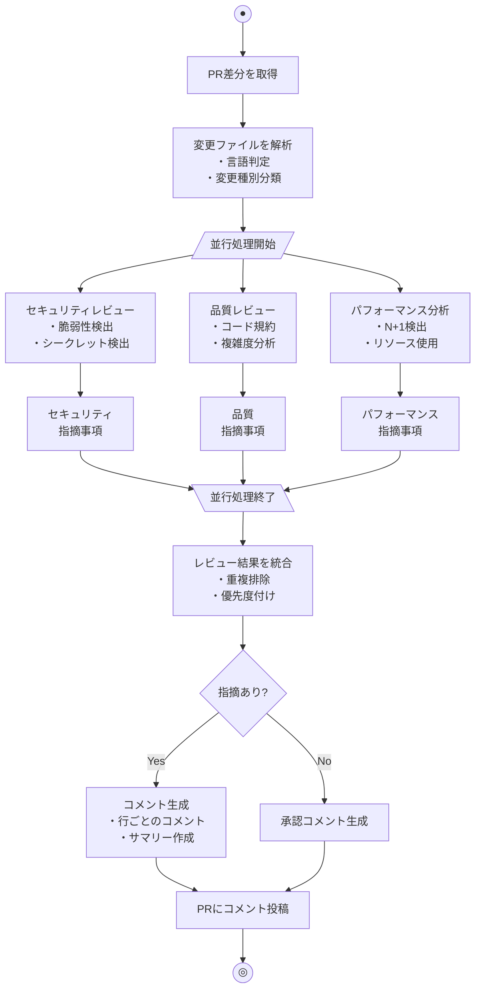
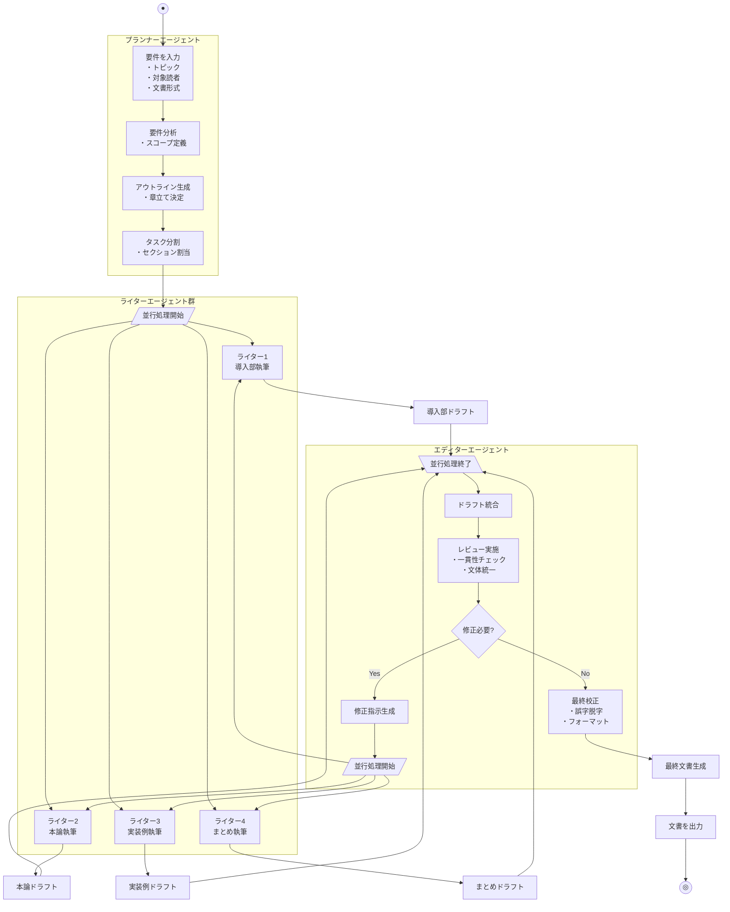
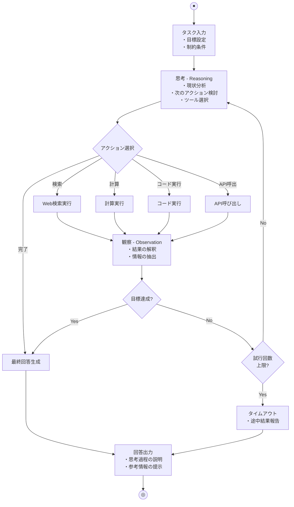

システムの振る舞いや業務プロセスを視覚化する手法として「アクティビティ図」があります。フローチャートと混同されがちですが、両者には明確な違いがあります。本記事では、アクティビティ図の基本から実践的な書き方、フローチャートとの違い、そしてLLMワークフローを題材にした実例まで詳しく解説します。

<!--truncate-->

## アクティビティ図とは

アクティビティ図（Activity Diagram）は、UML（統一モデリング言語）で定義されている行動図の一種です。システムやビジネスプロセスにおける**一連のアクティビティ（活動）の流れ**を視覚的に表現します。

### アクティビティ図の特徴

アクティビティ図は、以下の特徴を持ちます：

- **並行処理の表現**: フォーク（分岐）とジョイン（合流）で並列処理を明示
- **オブジェクトフローの表現**: データの流れを可視化
- **スイムレーン**: 責任の所在を明確に区分
- **例外処理**: 割り込みや例外フローの表現が可能
- **階層化**: 複雑な処理をサブアクティビティとして分割可能

## フローチャートとアクティビティ図の違い

フローチャートとアクティビティ図は見た目が似ていますが、その目的と表現力に大きな違いがあります。

### 比較表

| 観点 | フローチャート | アクティビティ図 |
|------|--------------|----------------|
| **起源** | 1920年代〜（工業工学） | 1997年〜（UML） |
| **標準化** | ISO 5807、JIS X 0121 | UML 2.x（OMG標準） |
| **並行処理** | 表現困難 | フォーク/ジョインで明示的に表現 |
| **責任の分離** | 表現困難 | スイムレーンで明示 |
| **オブジェクト** | データの流れは限定的 | オブジェクトノードで明示 |
| **例外処理** | 条件分岐で表現 | 割り込み領域で明示的に表現 |
| **主な用途** | アルゴリズム、単純な処理 | 業務プロセス、システムの振る舞い |
| **粒度** | 詳細な処理ステップ | 抽象的なアクティビティ |

### 具体的な違い

#### 1. 並行処理の表現

**フローチャート**では、並行処理を明示的に表現する標準的な記号がありません。処理が順番に実行されることを前提としています。

**アクティビティ図**では、**フォークバー**（黒い太線）で処理を分岐させ、**ジョインバー**で合流させることで、並行処理を明確に表現できます。

```
[フローチャート]
処理A → 処理B → 処理C → 処理D

[アクティビティ図]
処理A → ═══ → 処理B ─┐
            → 処理C ─┼→ ═══ → 処理D
                     └→
※ 処理B と 処理C は並行実行
```

#### 2. 責任の分離（スイムレーン）

**フローチャート**では、誰がその処理を担当するかを図中に明示する標準的な方法がありません。

**アクティビティ図**では、**スイムレーン**（またはパーティション）を使って、各アクティビティの担当者・担当システムを視覚的に分離できます。

```
┌─────────────┬─────────────┬─────────────┐
│   顧客      │   システム   │   在庫管理   │
├─────────────┼─────────────┼─────────────┤
│ [注文する]  │             │             │
│      │      │             │             │
│      └─────→│[在庫確認]   │             │
│             │      │      │             │
│             │      └─────→│[引き当て]   │
│             │             │      │      │
│             │      ←─────┘      │      │
│             │[決済処理]   │             │
└─────────────┴─────────────┴─────────────┘
```

#### 3. オブジェクトフロー

**フローチャート**はデータの流れを表現することが主目的ではなく、処理の流れに焦点を当てています。

**アクティビティ図**では、**オブジェクトノード**（四角形）を使って、アクティビティ間で受け渡されるデータや成果物を明示できます。

## アクティビティ図の基本要素

アクティビティ図を構成する主要な要素を解説します。

### 1. 開始ノード・終了ノード

```
● 開始ノード（黒丸）
◎ 終了ノード（二重丸）
⊗ フロー終了ノード（丸にX）
```

- **開始ノード**: アクティビティの開始点。1つのダイアグラムに1つ
- **終了ノード**: アクティビティ全体の終了。すべてのフローが終了
- **フロー終了ノード**: 特定のフローのみ終了。他のフローは継続

### 2. アクションノード

```
┌─────────────────┐
│  注文を処理する   │
└─────────────────┘
```

実際の処理・作業を表す角丸四角形です。動詞を使って「何をするか」を記述します。

### 3. 決定ノード・マージノード

```
    ◇ 決定ノード（分岐）
   ↙ ↘
 [Yes] [No]
   ↘ ↙
    ◇ マージノード（合流）
```

- **決定ノード**: ひし形で表し、条件によって処理を分岐
- **マージノード**: 複数のフローを1つに合流

### 4. フォーク・ジョイン

```
────────────  フォークバー（並行処理の開始）
     │
   ┌─┴─┐
   ↓   ↓
 処理A  処理B（並行実行）
   ↓   ↓
   └─┬─┘
     │
────────────  ジョインバー（並行処理の終了）
```

- **フォーク**: 1つのフローを複数の並行フローに分割
- **ジョイン**: 複数の並行フローを1つに合流（すべて完了を待つ）

### 5. スイムレーン（パーティション）

```
┌──────────────┬──────────────┐
│    営業部    │    経理部     │
├──────────────┼──────────────┤
│              │              │
│   処理群     │    処理群    │
│              │              │
└──────────────┴──────────────┘
```

責任や役割ごとにアクティビティを分離して配置します。

### 6. オブジェクトノード

```
┌───────────┐
│  注文書   │
│  [作成済] │
└───────────┘
```

アクティビティ間で受け渡されるデータや成果物を表します。状態を角括弧で示すことも可能です。

## Mermaidでアクティビティ図を描く

Mermaidの `flowchart` や `stateDiagram` を使ってアクティビティ図風の図を描くことができます。以下は基本的な例です。



## LLMワークフローをアクティビティ図で表現する

ここからは、実際のLLM（大規模言語モデル）を活用したワークフローをアクティビティ図で表現してみます。

### ユースケース: RAGベースの技術ドキュメントQ&Aシステム

社内の技術ドキュメントに対して自然言語で質問し、関連情報を検索して回答を生成するRAG（Retrieval-Augmented Generation）システムを例に取ります。

#### システム概要

1. ユーザーが自然言語で質問を入力
2. クエリを分析・最適化
3. ベクトルデータベースから関連ドキュメントを検索
4. 検索結果の関連性を評価
5. LLMでコンテキストを踏まえた回答を生成
6. 回答の品質をチェック
7. ユーザーに回答を返却

#### アクティビティ図（テキスト表現）

```
┌──────────────────────────────────────────────────────────────────────────┐
│                    RAG Q&A システム アクティビティ図                       │
├──────────────┬───────────────┬───────────────┬──────────────────────────┤
│   ユーザー    │  クエリ処理   │  検索エンジン  │      LLM エージェント      │
├──────────────┼───────────────┼───────────────┼──────────────────────────┤
│      ●       │               │               │                          │
│      │       │               │               │                          │
│      ▼       │               │               │                          │
│ ┌─────────┐  │               │               │                          │
│ │質問を入力│  │               │               │                          │
│ └────┬────┘  │               │               │                          │
│      │       │               │               │                          │
│      └──────→│ ┌───────────┐ │               │                          │
│              │ │クエリ分析  │ │               │                          │
│              │ │・意図抽出  │ │               │                          │
│              │ │・キーワード│ │               │                          │
│              │ └─────┬─────┘ │               │                          │
│              │       │       │               │                          │
│              │       ▼       │               │                          │
│              │ ┌───────────┐ │               │                          │
│              │ │クエリ拡張  │ │               │                          │
│              │ │・同義語追加│ │               │                          │
│              │ │・ベクトル化│ │               │                          │
│              │ └─────┬─────┘ │               │                          │
│              │       │       │               │                          │
│              │       └──────→│ ┌───────────┐ │                          │
│              │               │ │ベクトル検索│ │                          │
│              │               │ └─────┬─────┘ │                          │
│              │               │       │       │                          │
│              │               │       ▼       │                          │
│              │               │ ┌───────────┐ │                          │
│              │               │ │キーワード  │ │                          │
│              │               │ │ハイブリッド│ │                          │
│              │               │ │検索       │ │                          │
│              │               │ └─────┬─────┘ │                          │
│              │               │       │       │                          │
│              │               │       ▼       │                          │
│              │               │   ◇ 結果 > 0? │                          │
│              │               │   │       │   │                          │
│              │               │ [Yes]   [No]  │                          │
│              │               │   │       │   │                          │
│              │               │   │       └───────→ ┌─────────────────┐   │
│              │               │   │               │ │「該当なし」回答 │   │
│              │               │   │               │ │生成            │   │
│              │               │   │               │ └────────┬────────┘   │
│              │               │   │               │          │            │
│              │               │   ▼               │          │            │
│              │               │ ┌───────────┐    │          │            │
│              │               │ │関連度評価  │    │          │            │
│              │               │ │・リランク  │    │          │            │
│              │               │ │・スコア付与│    │          │            │
│              │               │ └─────┬─────┘    │          │            │
│              │               │       │          │          │            │
│              │               │       └─────────→│ ┌─────────────────┐   │
│              │               │                  │ │コンテキスト構築 │   │
│              │               │                  │ │・ドキュメント   │   │
│              │               │                  │ │  チャンク選択   │   │
│              │               │                  │ │・プロンプト生成 │   │
│              │               │                  │ └────────┬────────┘   │
│              │               │                  │          │            │
│              │               │                  │          ▼            │
│              │               │                  │ ┌─────────────────┐   │
│              │               │                  │ │ LLM 回答生成    │   │
│              │               │                  │ │・GPT-4/Claude   │   │
│              │               │                  │ │・ストリーミング │   │
│              │               │                  │ └────────┬────────┘   │
│              │               │                  │          │            │
│              │               │                  │          ▼            │
│              │               │                  │    ◇ 品質チェック     │
│              │               │                  │    │           │      │
│              │               │                  │  [OK]       [NG]      │
│              │               │                  │    │           │      │
│              │               │                  │    │     ┌─────┘      │
│              │               │                  │    │     ▼            │
│              │               │                  │    │ ┌─────────────┐  │
│              │               │                  │    │ │回答を再生成 │  │
│              │               │                  │    │ │・プロンプト │  │
│              │               │                  │    │ │  調整      │  │
│              │               │                  │    │ └──────┬──────┘  │
│              │               │                  │    │        │         │
│              │               │                  │    ◇←───────┘         │
│              │               │                  │    │                  │
│      ←──────────────────────────────────────────────┘                   │
│      │       │               │                  │                       │
│      ▼       │               │                  │                       │
│ ┌─────────┐  │               │                  │                       │
│ │回答を表示│  │               │                  │                       │
│ └────┬────┘  │               │                  │                       │
│      │       │               │                  │                       │
│      ▼       │               │                  │                       │
│      ◎      │               │                  │                       │
└──────────────┴───────────────┴───────────────┴──────────────────────────┘
```

#### Mermaid での表現



### ユースケース: AIコードレビューエージェント

プルリクエストが作成されたときに自動でコードレビューを行うAIエージェントのワークフローです。

#### システム概要

1. PRの変更差分を取得
2. 変更ファイルを分類（言語、変更種別）
3. 並行して複数の観点でレビュー実行
   - セキュリティチェック
   - コード品質チェック
   - パフォーマンス分析
4. レビュー結果を統合
5. コメントを生成してPRに投稿

#### アクティビティ図（Mermaid）



### ユースケース: マルチエージェント文書作成システム

複数のAIエージェントが協調して技術文書を作成するワークフローです。

#### システム概要

1. ユーザーが文書の要件を入力
2. プランナーエージェントが構成を計画
3. 並行してセクションごとに執筆
4. エディターエージェントがレビュー・校正
5. 最終文書を生成

#### アクティビティ図（Mermaid）



### ユースケース: 自律型問題解決エージェント（ReActパターン）

LLMが自律的に思考・行動・観察を繰り返して問題を解決するReAct（Reasoning and Acting）パターンのワークフローです。

#### システム概要

1. ユーザーがタスクを入力
2. エージェントが思考（Reasoning）
3. 行動を選択・実行（Acting）
4. 結果を観察（Observation）
5. 目標達成まで2-4を繰り返し

#### アクティビティ図（Mermaid）



## アクティビティ図を書くときのベストプラクティス

### 1. 適切な抽象度を選ぶ

アクティビティは適切な粒度で記述します。細かすぎると複雑になり、粗すぎると意味がなくなります。

```
❌ 悪い例（細かすぎる）
「変数を初期化」→「ループを開始」→「条件を評価」→...

✅ 良い例（適切な粒度）
「注文データを検証」→「在庫を確認」→「決済を処理」→...
```

### 2. 動詞から始める命名

アクティビティ名は「何をするか」がわかるように動詞から始めます。

```
❌ 悪い例: 「注文」「在庫」「決済」
✅ 良い例: 「注文を処理する」「在庫を確認する」「決済を実行する」
```

### 3. スイムレーンを活用する

責任の所在が重要な場合は、必ずスイムレーンを使って明確にします。特にシステム間連携や部門をまたぐ業務フローで有効です。

### 4. 並行処理を明示する

処理が並行実行できる場合は、フォーク/ジョインを使って明示します。これにより、最適化の余地やボトルネックが可視化されます。

### 5. 例外フローを忘れない

正常系だけでなく、エラー時やタイムアウト時のフローも記述します。特にシステム設計では重要です。

## まとめ

アクティビティ図は、システムやビジネスプロセスの振る舞いを視覚化する強力なツールです。フローチャートと比較して、以下の点で優れています：

- **並行処理**をフォーク/ジョインで明確に表現
- **責任の分離**をスイムレーンで可視化
- **オブジェクトの流れ**を明示的に表現
- **UML標準**に準拠し、設計ドキュメントとして一貫性を保てる

LLMを活用したシステムでは、複数のエージェントが並行して動作したり、思考・行動・観察のループが発生したりと、複雑なワークフローになりがちです。アクティビティ図を使うことで、これらの複雑な処理フローを明確に可視化し、チーム内での認識を揃えることができます。

フローチャートは単純なアルゴリズムの説明に、アクティビティ図は複雑なシステムの振る舞い記述に、それぞれ使い分けることで、より効果的なドキュメンテーションが実現できます。
