「アクセストークンだけでいいじゃん、なんでリフレッシュトークンが必要なの？」

この疑問、実はとても良い質問です。この記事では、**レストランの食券システム**をたとえに、2つのトークンが必要な理由を図解でわかりやすく解説します。

<!--truncate-->

## この記事で学べること

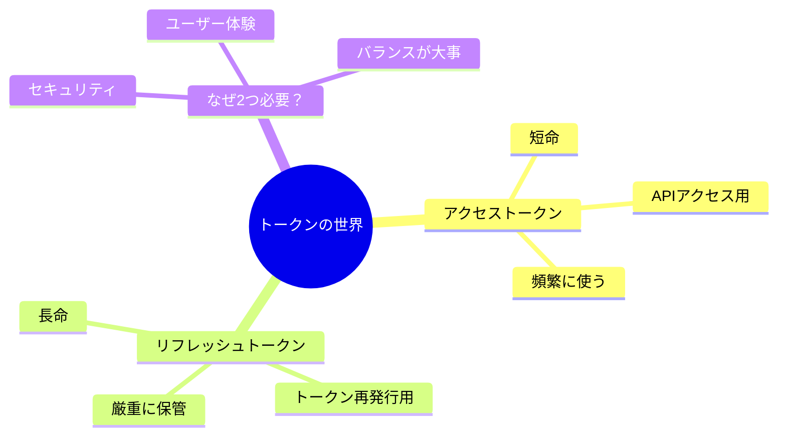

## 第1章：レストランで理解するトークンの仕組み

まず、**レストランの食券システム**でトークンの役割を理解しましょう。

### 登場人物

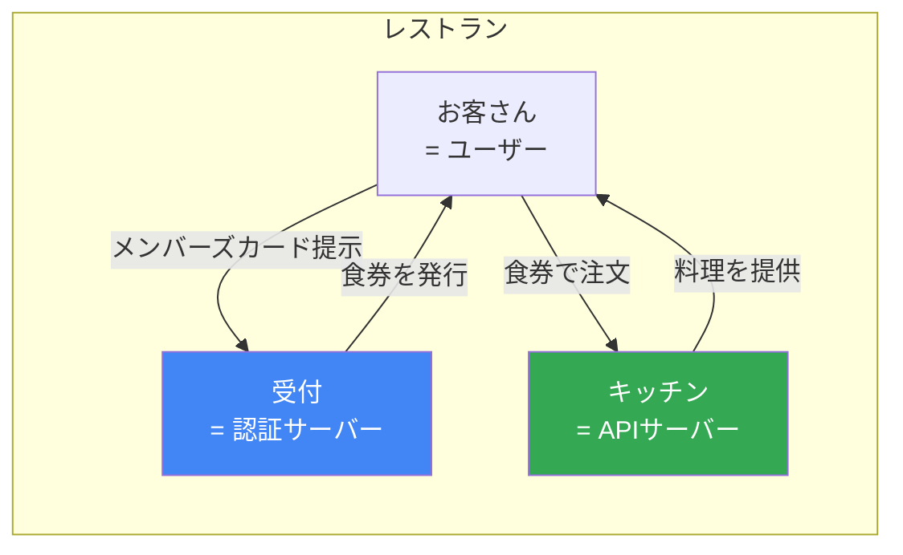

| レストラン | システム | 役割 |
|-----------|----------|------|
| お客さん | ユーザー | サービスを使いたい人 |
| 受付 | 認証サーバー | 本人確認・トークン発行 |
| キッチン | APIサーバー | 実際のサービス提供 |
| メンバーズカード | リフレッシュトークン | 長期的な会員証明 |
| 食券 | アクセストークン | その場限りの利用権 |

## 第2章：アクセストークン - 「食券」のたとえ

### アクセストークンとは

:::tip 食券のたとえ
レストランで**食券**を買ったことはありますか？

食券の特徴：
- **その日限り有効**（翌日は使えない）
- **特定の料理専用**（ラーメン食券でカレーは食べられない）
- **誰でも使える**（落としたら他人に使われる可能性）
- **安い**（なくしても大損害ではない）

これが**アクセストークン**のイメージです！
:::

```mermaid
flowchart TB
    subgraph アクセストークン = 食券
    A[有効期限: 短い<br>通常15分〜1時間]
    B[用途: APIへのアクセス]
    C[特徴: 頻繁に使う]
    D[リスク: 盗まれる可能性あり]
    end

    style A fill:#e3f2fd
    style B fill:#e3f2fd
    style C fill:#e3f2fd
    style D fill:#ffcdd2
```

### 食券（アクセストークン）の使い方

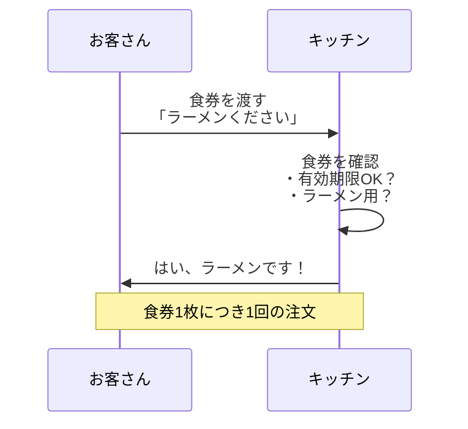

### なぜ食券は短命なのか

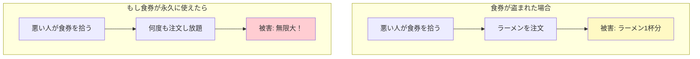

:::warning ポイント
アクセストークンが短命なのは、**盗まれたときの被害を最小限にするため**です。

15分で期限切れなら、攻撃者が悪用できる時間も15分だけ！
:::

## 第3章：リフレッシュトークン - 「メンバーズカード」のたとえ

### リフレッシュトークンとは

:::tip メンバーズカードのたとえ
レストランの**メンバーズカード**を想像してください。

メンバーズカードの特徴：
- **長期間有効**（年会員など）
- **本人しか使えない**（顔写真付き）
- **新しい食券を発行できる**
- **なくしたら大変**（再発行に手間がかかる）
- **財布の奥に大切に保管**

これが**リフレッシュトークン**のイメージです！
:::

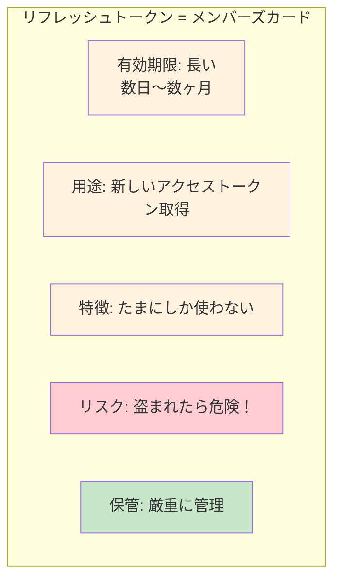

### メンバーズカード（リフレッシュトークン）の使い方

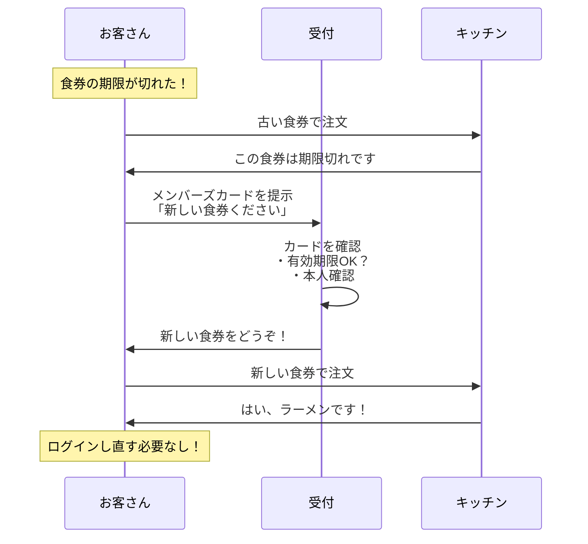

## 第4章：なぜアクセストークンだけでは足りないのか

ここが本記事の核心です。「食券だけでいいじゃん」と思うかもしれませんが、それでは困る理由があります。

### パターン1：アクセストークンだけ（有効期限が短い場合）

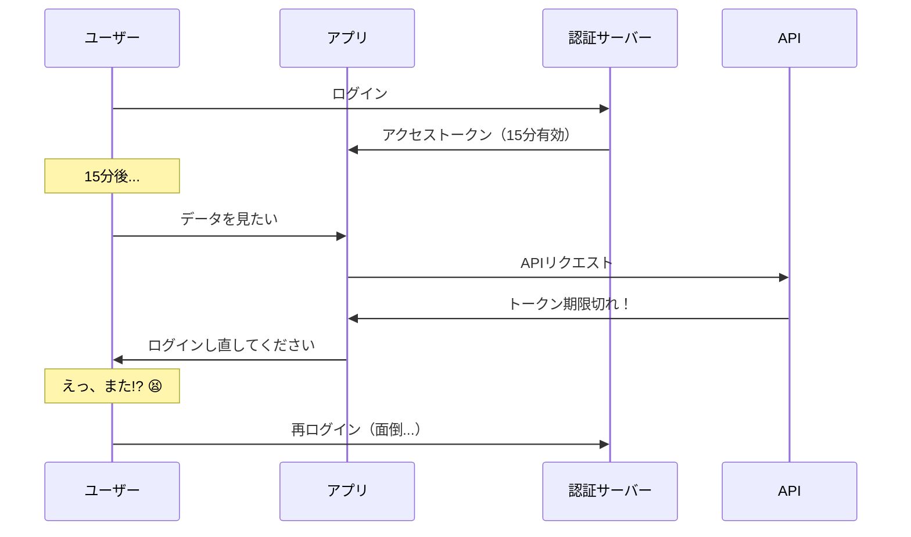

:::danger 問題点
15分ごとにログインし直し？ユーザーは逃げていきます！

**ユーザー体験が最悪**です。
:::

### パターン2：アクセストークンだけ（有効期限が長い場合）

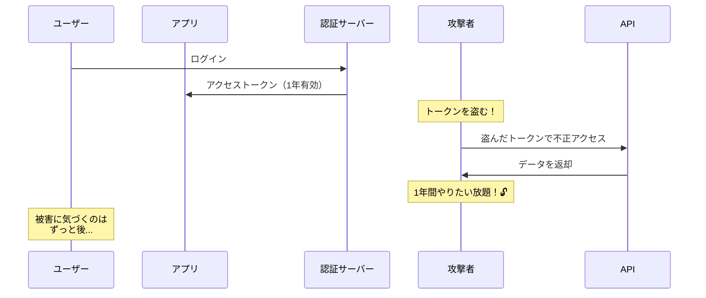

:::danger 問題点
トークンが盗まれたら1年間も悪用され放題！

**セキュリティリスクが致命的**です。
:::

### 2つのトークンで解決！

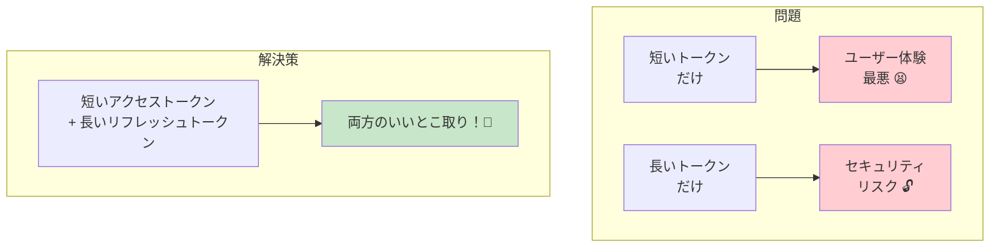

## 第5章：2つのトークンの連携プレー

### 実際のフロー

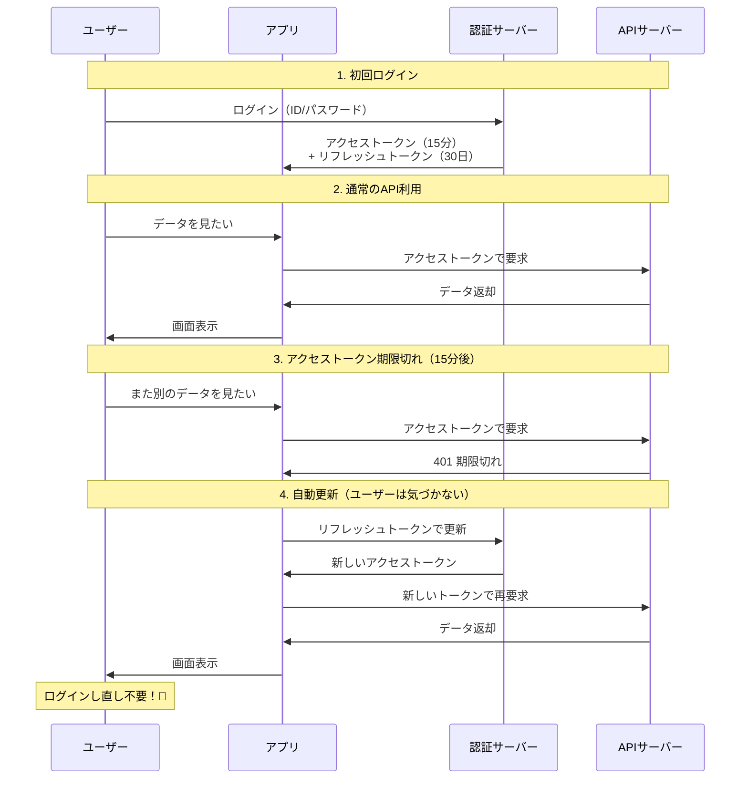

### 連携のポイント

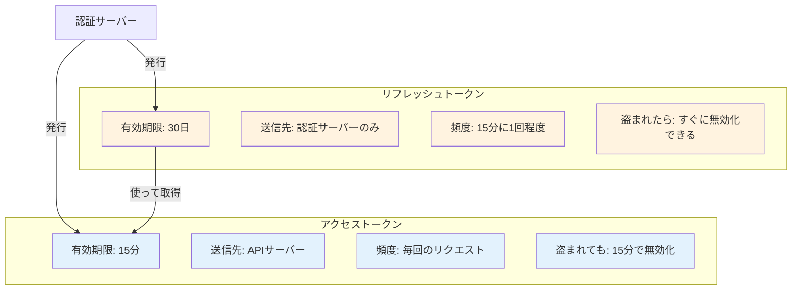

## 第6章：セキュリティの観点から深掘り

### なぜリフレッシュトークンは盗まれにくいのか

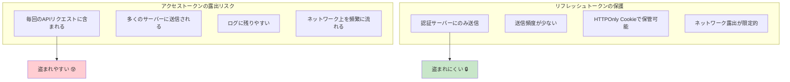

### トークンが盗まれたときの比較

| シナリオ | アクセストークンが盗まれた | リフレッシュトークンが盗まれた |
|----------|--------------------------|------------------------------|
| 被害期間 | 最大15分 | 発覚までの期間 |
| 対処法 | 放置でも期限切れ | 即座に無効化が必要 |
| 検知 | 難しい | 異常なIP/デバイスで検知可能 |
| 被害範囲 | 限定的 | 新しいアクセストークンを発行され続ける |

### リフレッシュトークンの安全対策

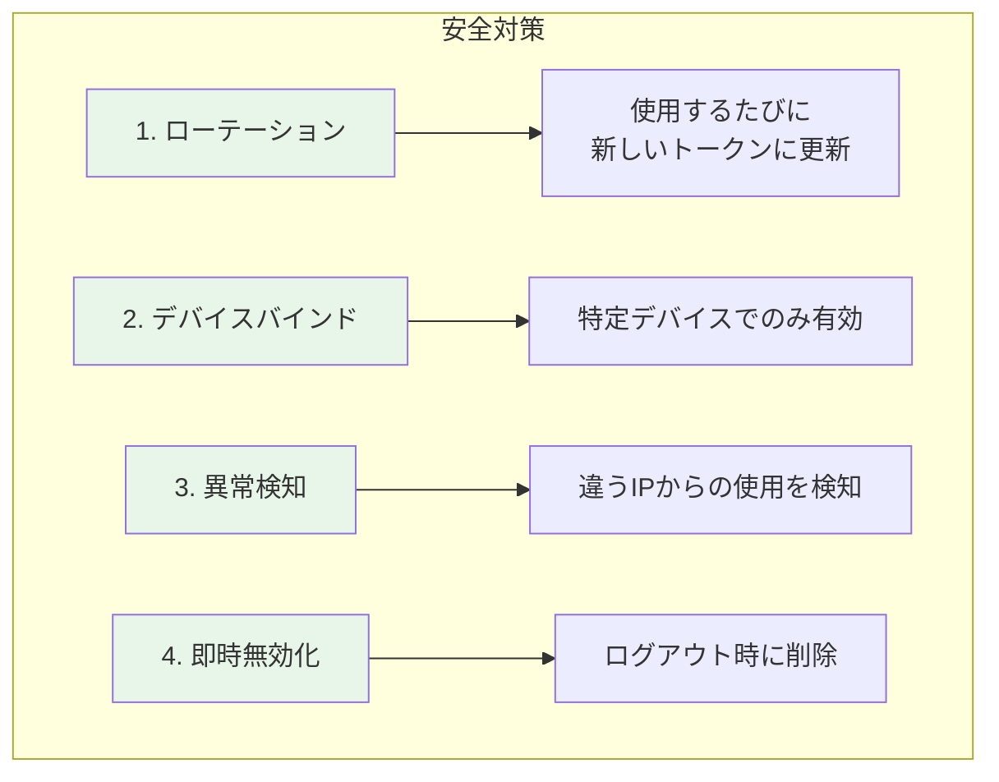

#### リフレッシュトークンのローテーション

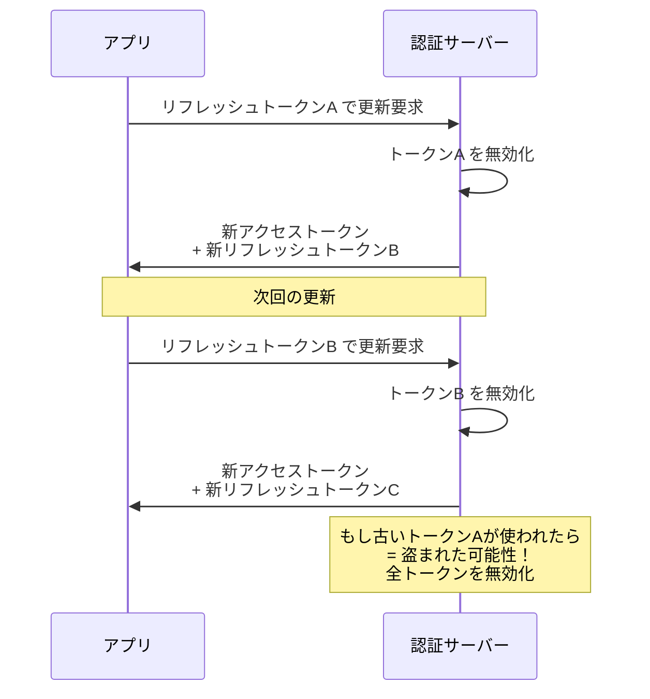

## 第7章：実装パターン

### Webアプリケーション

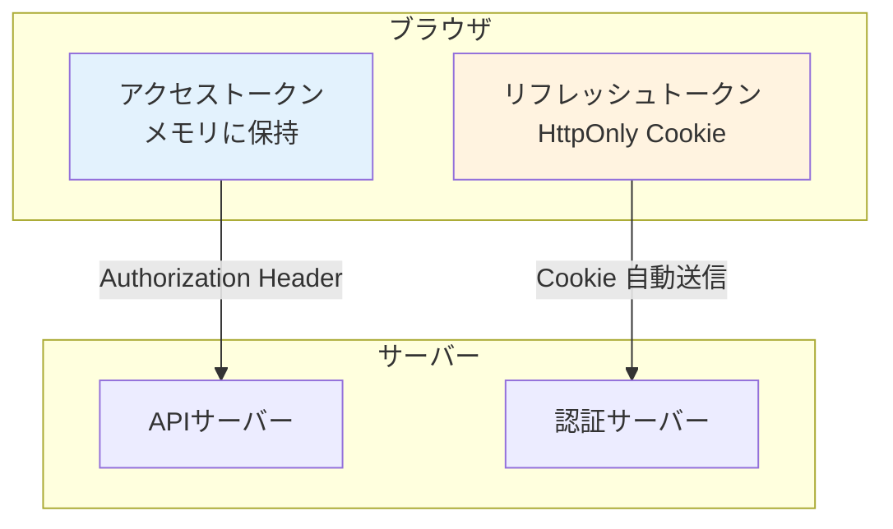

:::info ベストプラクティス
- **アクセストークン**: JavaScriptのメモリに保持（localStorageは危険）
- **リフレッシュトークン**: HttpOnly Cookie（JavaScriptからアクセス不可）
:::

### モバイルアプリ

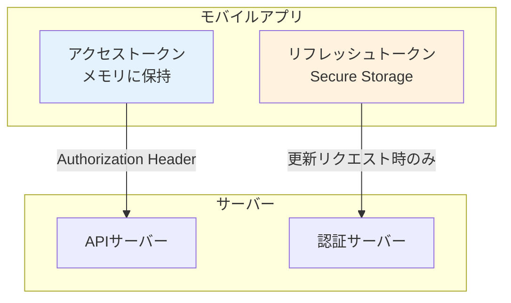

:::info ベストプラクティス
- **iOS**: Keychain
- **Android**: Encrypted SharedPreferences または Keystore
:::

## 第8章：よくある質問（FAQ）

### Q1: リフレッシュトークンも盗まれたらどうするの？

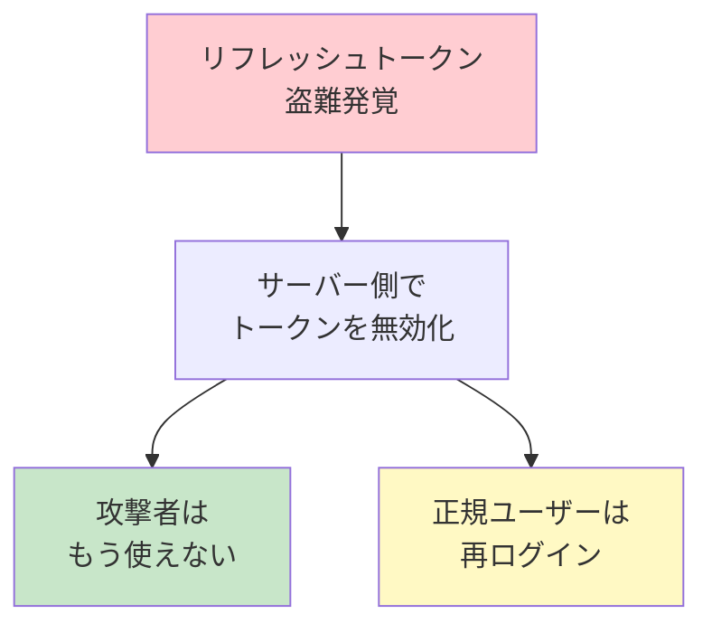

アクセストークンは「サーバーに問い合わせずに検証できる」設計のため、発行後に無効化が難しいです。一方、リフレッシュトークンはサーバーで管理されているため、即座に無効化できます。

### Q2: なぜアクセストークンをサーバーで管理しないの？

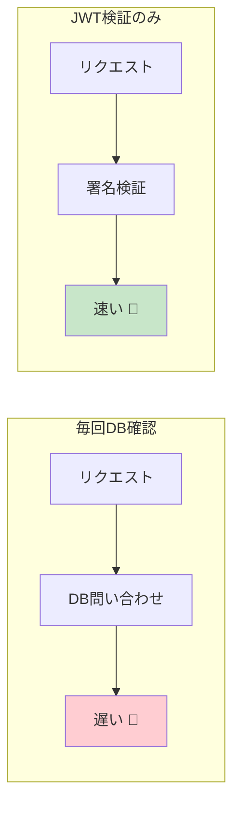

毎回のAPIリクエストでデータベースに問い合わせると、パフォーマンスが大幅に低下します。JWTなら署名を検証するだけで済むため、高速です。

### Q3: 有効期限はどのくらいが適切？

| トークン | 推奨有効期限 | 理由 |
|----------|-------------|------|
| アクセストークン | 15分〜1時間 | 盗まれても被害を最小限に |
| リフレッシュトークン | 7日〜30日 | ユーザー体験を損なわない |

:::tip 業界の例
- **Auth0**: アクセストークン 24時間、リフレッシュトークン 30日
- **Google**: アクセストークン 1時間、リフレッシュトークン 無期限（取り消しまで）
- **GitHub**: アクセストークン 8時間、リフレッシュトークン 6ヶ月
:::

### Q4: アクセストークンを更新するたびにリフレッシュトークンも変える？

```mermaid
flowchart TB
    subgraph ローテーションあり（推奨）
    A1[より安全]
    A2[盗難検知が可能]
    A3[実装がやや複雑]
    end

    subgraph ローテーションなし
    B1[リスクが高い]
    B2[実装は簡単]
    end

    style A1 fill:#c8e6c9
    style A2 fill:#c8e6c9
    style B1 fill:#ffcdd2
```

**ローテーションを推奨**します。OAuth 2.0のセキュリティベストプラクティスでも推奨されています。

## まとめ：2つのトークンの役割

```mermaid
flowchart TB
    subgraph セキュリティとUXのバランス
    A[アクセストークン<br>短命・頻繁に使用] --> C[セキュリティ確保<br>盗まれても15分で無効]
    B[リフレッシュトークン<br>長命・たまに使用] --> D[ユーザー体験確保<br>再ログイン不要]
    C --> E[両立！🎉]
    D --> E
    end

    style A fill:#e3f2fd
    style B fill:#fff3e0
    style C fill:#c8e6c9
    style D fill:#c8e6c9
    style E fill:#e8f5e9
```

### 最終比較表

| 項目 | アクセストークン | リフレッシュトークン |
|------|-----------------|---------------------|
| **たとえ** | 食券 | メンバーズカード |
| **有効期限** | 短い（15分〜1時間） | 長い（7日〜30日） |
| **送信先** | APIサーバー（毎回） | 認証サーバーのみ |
| **使用頻度** | 高い | 低い |
| **盗難リスク** | 高いが被害は限定的 | 低いが被害は大きい |
| **無効化** | 難しい（期限切れ待ち） | 即座に可能 |
| **保管場所** | メモリ | 安全なストレージ |

### 覚えておくべき3つのポイント

:::info 重要ポイント
1. **アクセストークンは「使い捨て」** - 短命で頻繁に更新される
2. **リフレッシュトークンは「更新用」** - 長命だが厳重に管理
3. **2つ組み合わせて「いいとこ取り」** - セキュリティとUXを両立
:::

## 関連記事

この記事で基礎を理解したら、以下の記事もおすすめです：

- [認証・認可からOIDC・トークンまで完全ガイド](/blog/authentication-authorization-guide) - 認証・認可の基礎から学びたい方へ

セキュリティは奥が深いですが、「なぜ2つ必要なのか」を理解すれば、実装時の判断に迷わなくなります。この記事があなたの理解の助けになれば幸いです！
