OAuth 2.0にはいくつかのフロー（認証の流れ）がありますが、現在最も推奨されているのが「**Authorization Code Flow + PKCE**」です。この記事では、図をふんだんに使って、なぜこのフローが安全なのか、どう動くのかを徹底解説します。

<!--truncate-->

## この記事で学べること

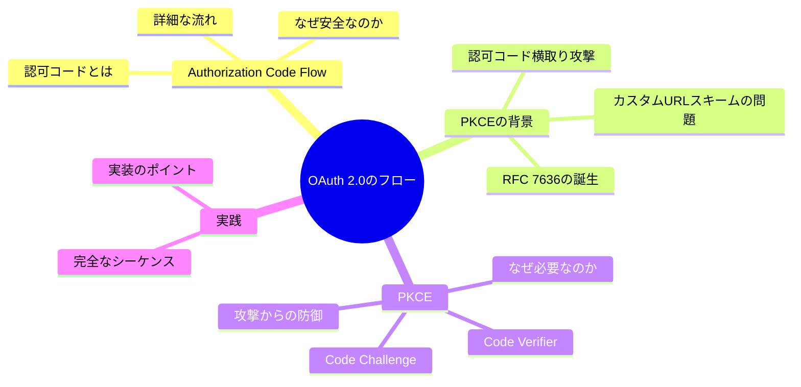
```mermaid
mindmap
  root((OAuth 2.0のフロー))
    Authorization Code Flow
      認可コードとは
      なぜ安全なのか
      詳細な流れ
    PKCEの背景
      カスタムURLスキームの問題
      認可コード横取り攻撃
      RFC 7636の誕生
    PKCE
      なぜ必要なのか
      Code Verifier
      Code Challenge
      攻撃からの防御
    実践
      完全なシーケンス
      実装のポイント
```

## 前提知識

この記事は[認証・認可からOIDC・トークンまで完全ガイド](/blog/authentication-authorization-guide)の続編です。以下の用語を理解していることを前提としています：

- 認証と認可の違い
- アクセストークン、IDトークン、リフレッシュトークン
- OIDCの基本的な仕組み

## 第1章：OAuth 2.0のフローの種類

まず、OAuth 2.0にどんなフローがあるのか全体像を把握しましょう。

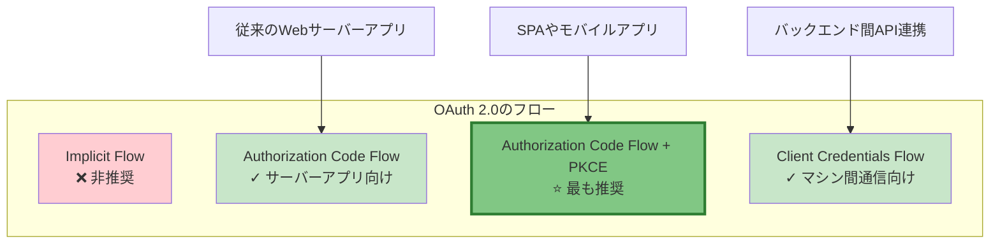
```mermaid
flowchart TB
    subgraph OAuth 2.0のフロー
    A[Implicit Flow<br>❌ 非推奨]
    B[Authorization Code Flow<br>✓ サーバーアプリ向け]
    C[Authorization Code Flow + PKCE<br>⭐ 最も推奨]
    D[Client Credentials Flow<br>✓ マシン間通信向け]
    end

    E[SPAやモバイルアプリ] --> C
    F[従来のWebサーバーアプリ] --> B
    G[バックエンド間API連携] --> D

    style A fill:#ffcdd2
    style B fill:#c8e6c9
    style C fill:#81c784,stroke:#2e7d32,stroke-width:3px
    style D fill:#c8e6c9
```

### なぜ「Authorization Code Flow + PKCE」が最強なのか？

| フロー | セキュリティ | 適用場面 | 現在の推奨度 |
|--------|------------|---------|-------------|
| Implicit Flow | 低い | ❌ 使用禁止 | ❌ 非推奨 |
| Authorization Code Flow | 高い | サーバーアプリ | ✓ 推奨 |
| **Auth Code + PKCE** | **最高** | **全アプリ** | **⭐ 最も推奨** |
| Client Credentials | 高い | マシン間のみ | ✓ 推奨 |

:::tip ポイント
2021年以降、OAuth 2.1のドラフトでは**すべてのクライアントにPKCEが必須**となりました。今から実装するなら、迷わず「Authorization Code Flow + PKCE」を選びましょう！
:::

## 第2章：Implicit Flowの問題点

まず、なぜ「Implicit Flow」が非推奨になったのかを理解しましょう。これを知ることで、Authorization Code Flowの価値がわかります。

### Implicit Flowの流れ（危険な例）

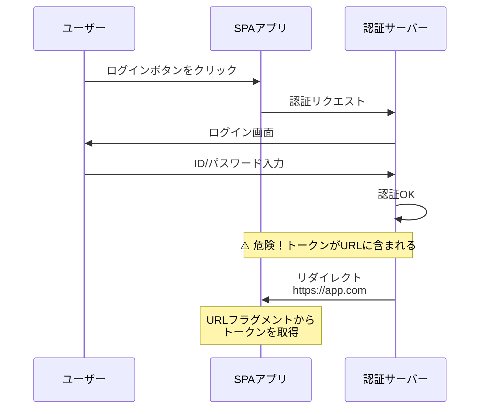
```mermaid
sequenceDiagram
    participant User as ユーザー
    participant App as SPAアプリ
    participant Auth as 認証サーバー

    User->>App: ログインボタンをクリック
    App->>Auth: 認証リクエスト
    Auth->>User: ログイン画面
    User->>Auth: ID/パスワード入力
    Auth->>Auth: 認証OK

    Note over Auth,App: ⚠️ 危険！トークンがURLに含まれる
    Auth->>App: リダイレクト<br>https://app.com#access_token=abc123

    Note over App: URLフラグメントから<br>トークンを取得
```

### Implicit Flowの危険性

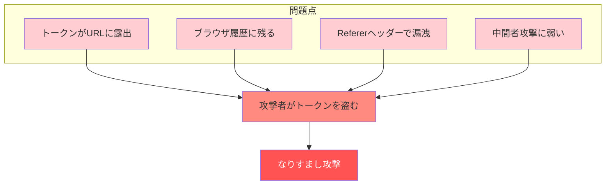
```mermaid
flowchart TB
    subgraph 問題点
    A[トークンがURLに露出]
    B[ブラウザ履歴に残る]
    C[Refererヘッダーで漏洩]
    D[中間者攻撃に弱い]
    end

    A --> E[攻撃者がトークンを盗む]
    B --> E
    C --> E
    D --> E
    E --> F[なりすまし攻撃]

    style A fill:#ffcdd2
    style B fill:#ffcdd2
    style C fill:#ffcdd2
    style D fill:#ffcdd2
    style E fill:#ff8a80
    style F fill:#ff5252,color:#fff
```

:::danger Implicit Flowの致命的な欠陥
1. **アクセストークンがURLに含まれる** → ブラウザ履歴やログに残る
2. **リフレッシュトークンが使えない** → 頻繁に再認証が必要
3. **トークン置換攻撃に脆弱** → 攻撃者が別のトークンをすり替え可能
:::

## 第3章：Authorization Code Flow - 認可コードの威力

### 認可コードとは？

:::tip 引換券のたとえ
**認可コード**は「景品引換券」のようなものです。

**Implicit Flow（危険）**：
- 景品（トークン）を直接手渡し → 途中で盗まれる可能性

**Authorization Code Flow（安全）**：
- まず引換券（認可コード）を渡す
- 引換券を裏口（バックチャネル）で景品と交換
- 途中で引換券を盗まれても、本人確認がないと景品はもらえない
:::

### Authorization Code Flowの全体像

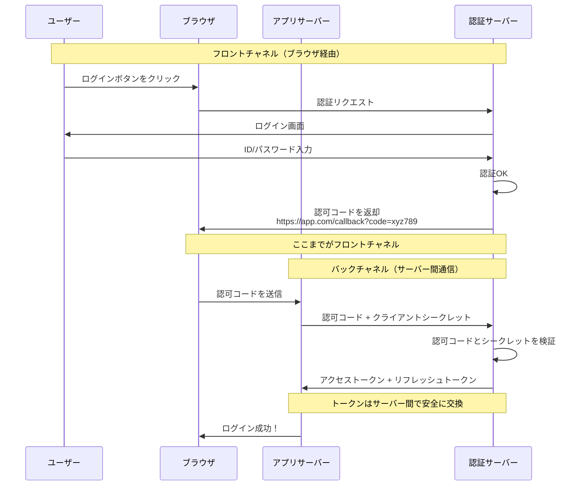
```mermaid
sequenceDiagram
    participant User as ユーザー
    participant Browser as ブラウザ
    participant App as アプリサーバー
    participant Auth as 認証サーバー

    Note over User,Auth: フロントチャネル（ブラウザ経由）

    User->>Browser: ログインボタンをクリック
    Browser->>Auth: 認証リクエスト
    Auth->>User: ログイン画面
    User->>Auth: ID/パスワード入力
    Auth->>Auth: 認証OK
    Auth->>Browser: 認可コードを返却<br>https://app.com/callback?code=xyz789

    Note over Browser,Auth: ここまでがフロントチャネル

    Note over App,Auth: バックチャネル（サーバー間通信）

    Browser->>App: 認可コードを送信
    App->>Auth: 認可コード + クライアントシークレット
    Auth->>Auth: 認可コードとシークレットを検証
    Auth->>App: アクセストークン + リフレッシュトークン

    Note over App,Auth: トークンはサーバー間で安全に交換

    App->>Browser: ログイン成功！
```

### フロントチャネルとバックチャネル

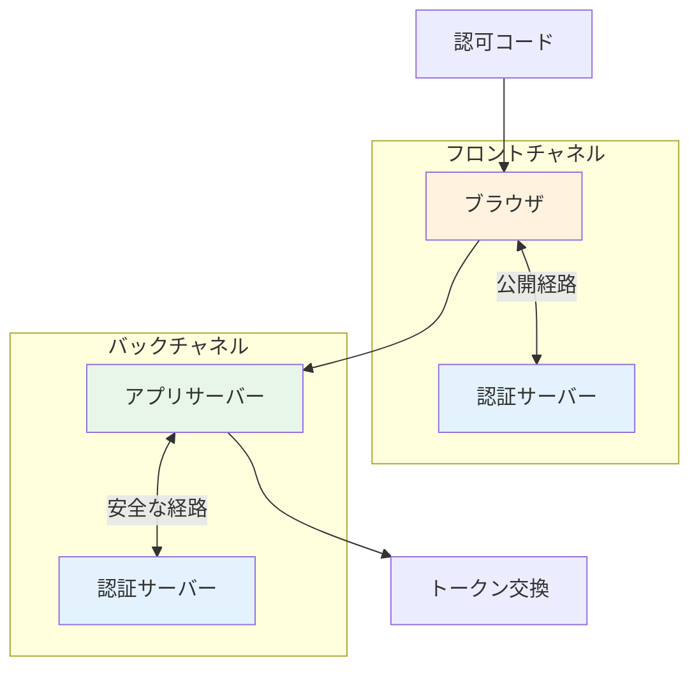
```mermaid
flowchart TB
    subgraph フロントチャネル
    direction LR
    A[ブラウザ] <-->|公開経路| B[認証サーバー]
    end

    subgraph バックチャネル
    direction LR
    C[アプリサーバー] <-->|安全な経路| D[認証サーバー]
    end

    E[認可コード] --> A
    A --> C
    C --> F[トークン交換]

    style A fill:#fff3e0
    style B fill:#e3f2fd
    style C fill:#e8f5e9
    style D fill:#e3f2fd
```

| チャネル | 経路 | 安全性 | 送るもの |
|---------|------|--------|---------|
| フロントチャネル | ブラウザ経由 | 低い（傍受可能） | 認可コード（短命・1回限り） |
| バックチャネル | サーバー間 | 高い（HTTPS） | トークン（クライアントシークレット付き） |

### なぜ認可コードは安全なのか？

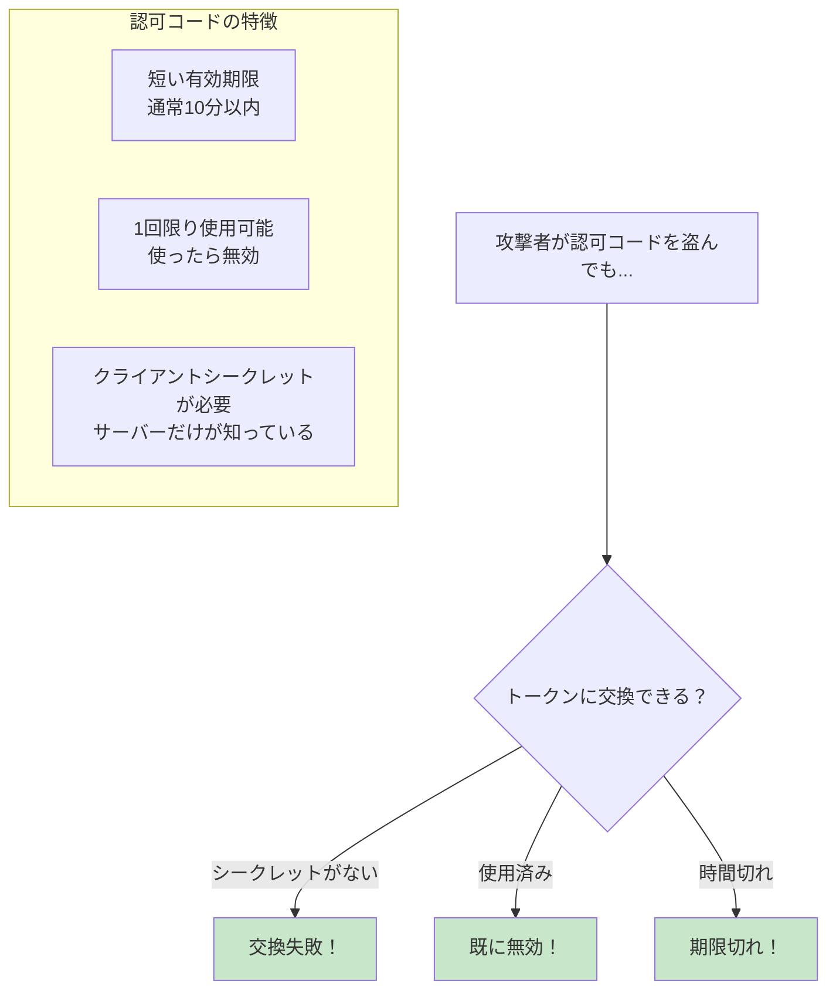
```mermaid
flowchart TB
    subgraph 認可コードの特徴
    A[短い有効期限<br>通常10分以内]
    B[1回限り使用可能<br>使ったら無効]
    C[クライアントシークレットが必要<br>サーバーだけが知っている]
    end

    D[攻撃者が認可コードを盗んでも...]
    D --> E{トークンに交換できる？}
    E -->|シークレットがない| F[交換失敗！]
    E -->|使用済み| G[既に無効！]
    E -->|時間切れ| H[期限切れ！]

    style F fill:#c8e6c9
    style G fill:#c8e6c9
    style H fill:#c8e6c9
```

## 第4章：PKCEが生まれた背景 - モバイルアプリの危機

Authorization Code Flow は安全ですが、**モバイルアプリやSPAでは使えない致命的な問題**がありました。PKCEはこの問題を解決するために2015年に策定されました。

### 問題の発端：カスタムURLスキームの罠

モバイルアプリでは、認証サーバーからのリダイレクト先として「カスタムURLスキーム」を使います。

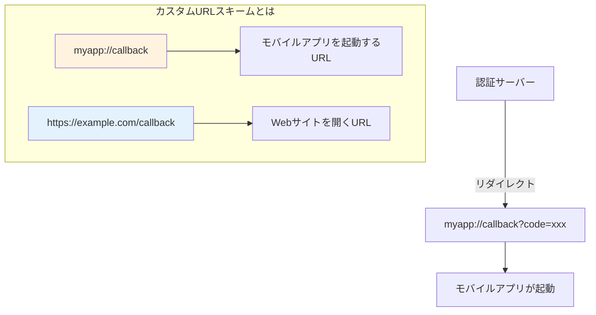
```mermaid
flowchart TB
    subgraph カスタムURLスキームとは
    A[myapp://callback] --> B[モバイルアプリを起動するURL]
    C[https://example.com/callback] --> D[Webサイトを開くURL]
    end

    E[認証サーバー] -->|リダイレクト| F[myapp://callback?code=xxx]
    F --> G[モバイルアプリが起動]

    style A fill:#fff3e0
    style C fill:#e3f2fd
```

:::danger カスタムURLスキームの問題
**同じURLスキームを複数のアプリが登録できてしまう！**

例：悪意のあるアプリが「myapp://」を横取り登録
- 正規アプリ：myapp:// を登録
- 悪意のあるアプリ：myapp:// を**同じく登録**
- OSはどちらに渡すか**保証しない**
:::

### 認可コード横取り攻撃（Authorization Code Interception Attack）

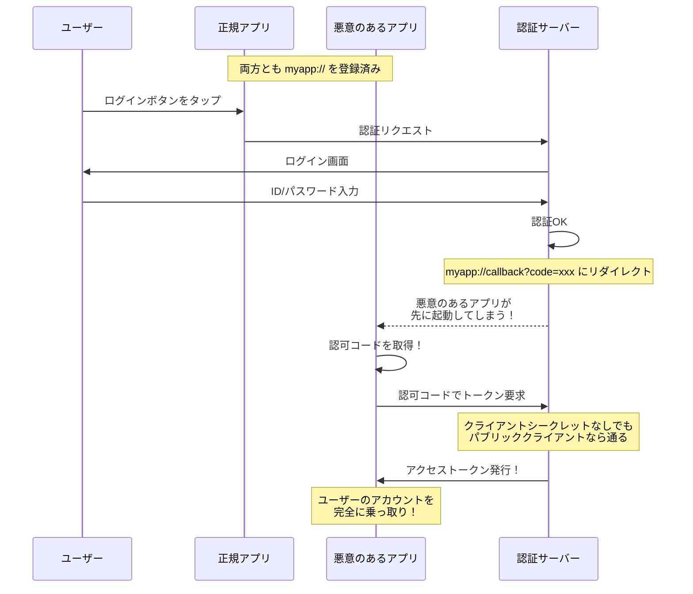
```mermaid
sequenceDiagram
    participant User as ユーザー
    participant LegitApp as 正規アプリ
    participant MalApp as 悪意のあるアプリ
    participant Auth as 認証サーバー

    Note over LegitApp,MalApp: 両方とも myapp:// を登録済み

    User->>LegitApp: ログインボタンをタップ
    LegitApp->>Auth: 認証リクエスト
    Auth->>User: ログイン画面
    User->>Auth: ID/パスワード入力
    Auth->>Auth: 認証OK

    Note over Auth: myapp://callback?code=xxx にリダイレクト

    Auth-->>MalApp: 悪意のあるアプリが<br>先に起動してしまう！

    MalApp->>MalApp: 認可コードを取得！
    MalApp->>Auth: 認可コードでトークン要求

    Note over Auth: クライアントシークレットなしでも<br>パブリッククライアントなら通る

    Auth->>MalApp: アクセストークン発行！

    Note over MalApp: ユーザーのアカウントを<br>完全に乗っ取り！
```

### なぜ従来の対策では防げなかったのか

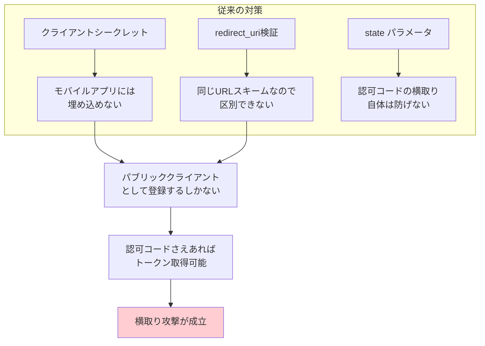
```mermaid
flowchart TB
    subgraph 従来の対策
    A[クライアントシークレット] --> B[モバイルアプリには<br>埋め込めない]
    C[redirect_uri検証] --> D[同じURLスキームなので<br>区別できない]
    E[state パラメータ] --> F[認可コードの横取り<br>自体は防げない]
    end

    B --> G[パブリッククライアント<br>として登録するしかない]
    D --> G
    G --> H[認可コードさえあれば<br>トークン取得可能]
    H --> I[横取り攻撃が成立]

    style I fill:#ffcdd2
```

| 対策 | 効果 | 限界 |
|------|------|------|
| クライアントシークレット | サーバーアプリでは有効 | モバイルには埋め込めない |
| redirect_uri完全一致 | Web では有効 | カスタムURLスキームでは区別不能 |
| state パラメータ | CSRF対策 | 横取り攻撃には無効 |

### RFC 7636の誕生（2015年）

この深刻な問題を解決するため、2015年にIETFは**RFC 7636 "Proof Key for Code Exchange by OAuth Public Clients"**を策定しました。

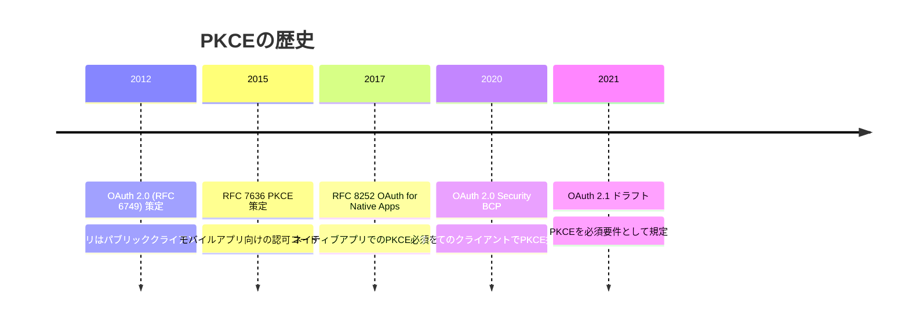
```mermaid
timeline
    title PKCEの歴史
    2012 : OAuth 2.0 (RFC 6749) 策定
         : モバイルアプリはパブリッククライアントとして運用
    2015 : RFC 7636 PKCE 策定
         : モバイルアプリ向けの認可コード保護
    2017 : RFC 8252 OAuth for Native Apps
         : ネイティブアプリでのPKCE必須を推奨
    2020 : OAuth 2.0 Security BCP
         : すべてのクライアントでPKCE推奨
    2021 : OAuth 2.1 ドラフト
         : PKCEを必須要件として規定
```

### PKCEの核心的なアイデア

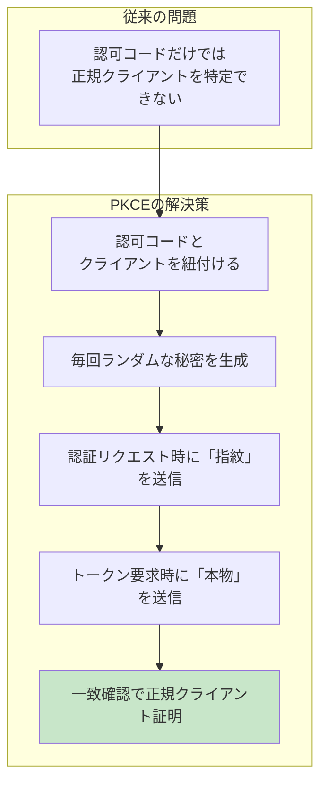
```mermaid
flowchart TB
    subgraph 従来の問題
    A[認可コードだけでは<br>正規クライアントを特定できない]
    end

    subgraph PKCEの解決策
    B[認可コードと<br>クライアントを紐付ける]
    C[毎回ランダムな秘密を生成]
    D[認証リクエスト時に「指紋」を送信]
    E[トークン要求時に「本物」を送信]
    F[一致確認で正規クライアント証明]
    end

    A --> B
    B --> C
    C --> D
    D --> E
    E --> F

    style F fill:#c8e6c9
```

:::tip PKCEが解決したこと
**「認可コードを発行したクライアント」と「トークンを要求するクライアント」が同一であることを証明**

- 悪意のあるアプリが認可コードを横取りしても
- Code Verifierを知らないのでトークンは取得できない
- **クライアントシークレット不要で、動的に生成された秘密で認証**
:::

### SPAへの適用拡大

当初はモバイルアプリ向けでしたが、SPAにも同様の問題があることが認識されました。

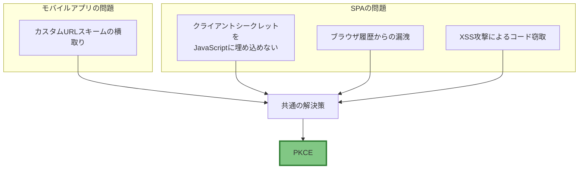
```mermaid
flowchart TB
    subgraph モバイルアプリの問題
    A[カスタムURLスキームの横取り]
    end

    subgraph SPAの問題
    B[クライアントシークレットを<br>JavaScriptに埋め込めない]
    C[ブラウザ履歴からの漏洩]
    D[XSS攻撃によるコード窃取]
    end

    E[共通の解決策] --> F[PKCE]

    A --> E
    B --> E
    C --> E
    D --> E

    style F fill:#81c784,stroke:#2e7d32,stroke-width:3px
```

### 現在：すべてのクライアントにPKCEを

```mermaid
flowchart LR
    subgraph 2015年
    A[PKCE] --> B[モバイルアプリ専用]
    end

    subgraph 2020年
    C[PKCE] --> D[SPA + モバイル必須<br>サーバーアプリは推奨]
    end

    subgraph 2021年〜
    E[PKCE] --> F[すべてのクライアントで必須<br>OAuth 2.1]
    end

    style F fill:#81c784,stroke:#2e7d32,stroke-width:2px
```

:::info OAuth 2.1での必須化
OAuth 2.1（ドラフト）では、**クライアントの種類に関係なくPKCEが必須**となりました。サーバーサイドアプリでもPKCEを使うことで、より堅牢なセキュリティを実現できます。
:::

---

## 第5章：PKCEの仕組み - 動的な秘密鍵

歴史的背景を理解したところで、PKCEの具体的な仕組みを見ていきましょう。

### クライアントシークレットを持てないアプリ

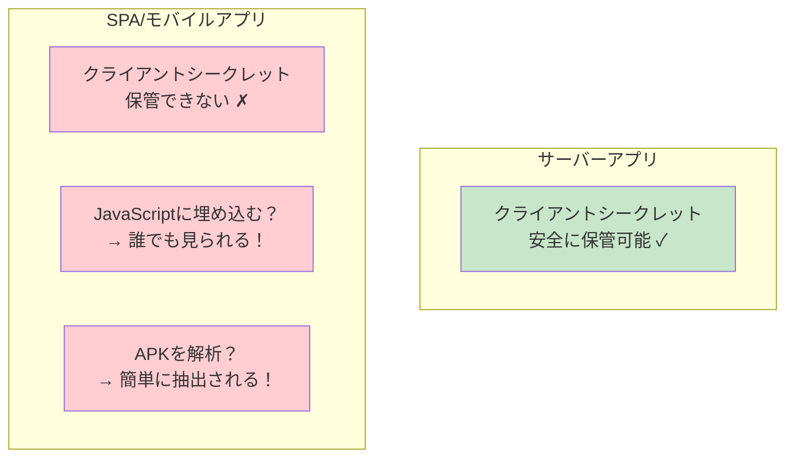
```mermaid
flowchart TB
    subgraph サーバーアプリ
    A[クライアントシークレット<br>安全に保管可能 ✓]
    end

    subgraph SPA/モバイルアプリ
    B[クライアントシークレット<br>保管できない ✗]
    C[JavaScriptに埋め込む？<br>→ 誰でも見られる！]
    D[APKを解析？<br>→ 簡単に抽出される！]
    end

    style A fill:#c8e6c9
    style B fill:#ffcdd2
    style C fill:#ffcdd2
    style D fill:#ffcdd2
```

:::warning SPAやモバイルアプリの課題
- クライアントシークレットをコードに埋め込むと、誰でも見られてしまう
- シークレットなしだと、認可コードを盗まれたら不正にトークン取得される
- **解決策：PKCE（ピクシー）**
:::

### PKCE（Proof Key for Code Exchange）とは

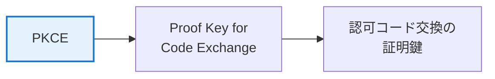
```mermaid
flowchart LR
    A[PKCE] --> B[Proof Key for<br>Code Exchange]
    B --> C[認可コード交換の<br>証明鍵]

    style A fill:#e3f2fd,stroke:#1976d2,stroke-width:2px
```

:::tip PKCEのたとえ：ロッカーの鍵
クライアントシークレットの代わりに、**毎回使い捨ての鍵**を使います。

1. **Code Verifier（コード検証子）**：ロッカーの鍵（ランダムな文字列）
2. **Code Challenge（コードチャレンジ）**：鍵の指紋（検証子のハッシュ）

流れ：
1. 鍵を作って、指紋だけを認証サーバーに渡す
2. 認可コードをもらう
3. 認可コード + 本物の鍵を見せてトークンをもらう
4. 認証サーバーは「指紋と鍵が一致するか」を確認
:::

### Code VerifierとCode Challenge

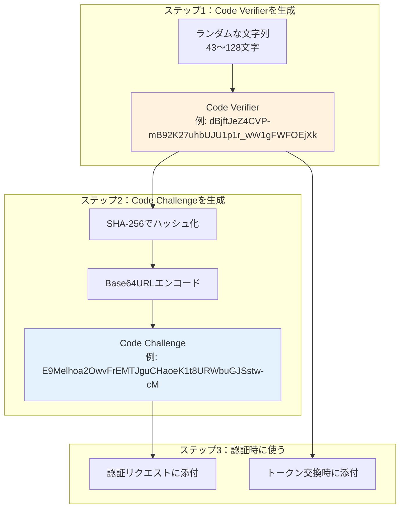
```mermaid
flowchart TB
    subgraph Step1[ステップ1：Code Verifierを生成]
    A[ランダムな文字列<br>43〜128文字] --> B[Code Verifier<br>例: dBjftJeZ4CVP-mB92K27uhbUJU1p1r_wW1gFWFOEjXk]
    end

    subgraph Step2[ステップ2：Code Challengeを生成]
    B --> C[SHA-256でハッシュ化]
    C --> D[Base64URLエンコード]
    D --> E[Code Challenge<br>例: E9Melhoa2OwvFrEMTJguCHaoeK1t8URWbuGJSstw-cM]
    end

    subgraph Step3[ステップ3：認証時に使う]
    E --> F[認証リクエストに添付]
    B --> G[トークン交換時に添付]
    end

    style B fill:#fff3e0
    style E fill:#e3f2fd
```

```
【生成方法】
Code Verifier: ランダムな43〜128文字の文字列
Code Challenge: Base64URL(SHA-256(Code Verifier))
```

### PKCEによる防御

```mermaid
sequenceDiagram
    participant Attacker as 攻撃者
    participant User as 正規ユーザー
    participant Auth as 認証サーバー

    Note over User: Code Verifier を生成（秘密）
    Note over User: Code Challenge を計算

    User->>Auth: 認証リクエスト<br>+ Code Challenge
    Auth->>Auth: Code Challenge を保存
    Auth->>User: 認可コード発行

    Note over Attacker: 認可コードを傍受！

    Attacker->>Auth: 認可コードでトークン要求<br>（Code Verifierを知らない）
    Auth->>Auth: Code Verifierがない！
    Auth->>Attacker: 拒否！

    User->>Auth: 認可コード + Code Verifier
    Auth->>Auth: SHA-256(Verifier) = Challenge?
    Auth->>Auth: 一致！本人確認OK
    Auth->>User: トークン発行

    style Attacker fill:#ff8a80
```

### なぜPKCEは安全なのか？

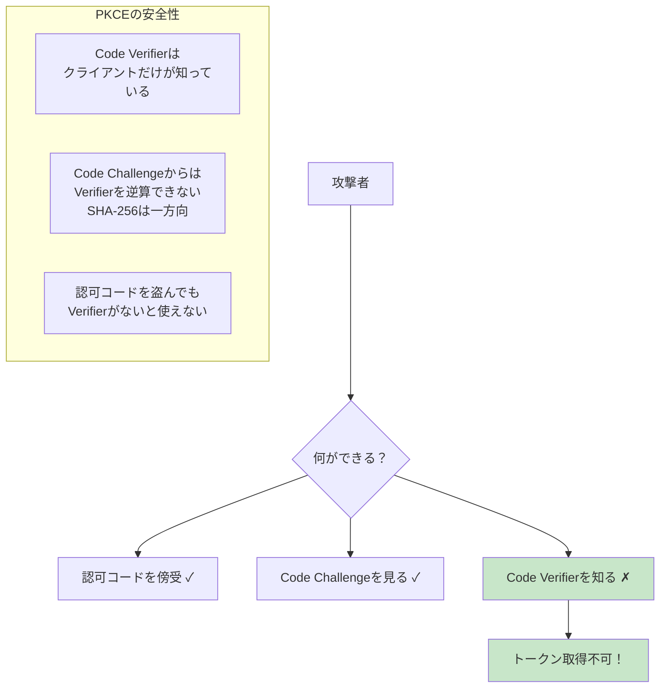
```mermaid
flowchart TB
    subgraph PKCEの安全性
    A[Code Verifierは<br>クライアントだけが知っている]
    B[Code Challengeからは<br>Verifierを逆算できない<br>SHA-256は一方向]
    C[認可コードを盗んでも<br>Verifierがないと使えない]
    end

    D[攻撃者] --> E{何ができる？}
    E --> F[認可コードを傍受 ✓]
    E --> G[Code Challengeを見る ✓]
    E --> H[Code Verifierを知る ✗]

    H --> I[トークン取得不可！]

    style I fill:#c8e6c9
    style H fill:#c8e6c9
```

## 第6章：Authorization Code Flow + PKCE 完全シーケンス

すべてを組み合わせた、完全な流れを見てみましょう。

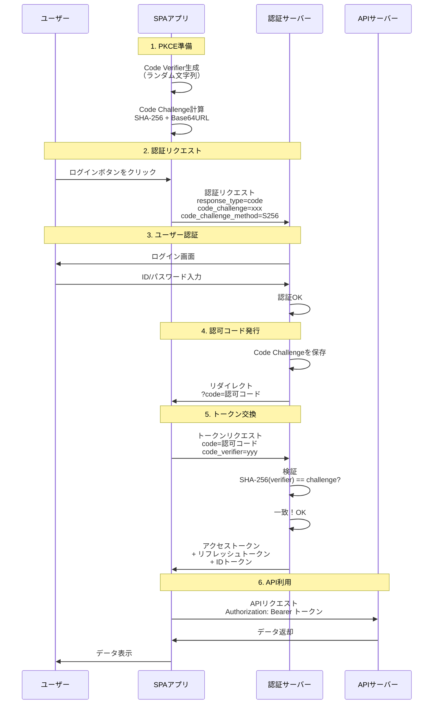
```mermaid
sequenceDiagram
    participant User as ユーザー
    participant App as SPAアプリ
    participant Auth as 認証サーバー
    participant API as APIサーバー

    Note over App: 1. PKCE準備
    App->>App: Code Verifier生成<br>（ランダム文字列）
    App->>App: Code Challenge計算<br>SHA-256 + Base64URL

    Note over User,Auth: 2. 認証リクエスト
    User->>App: ログインボタンをクリック
    App->>Auth: 認証リクエスト<br>response_type=code<br>code_challenge=xxx<br>code_challenge_method=S256

    Note over User,Auth: 3. ユーザー認証
    Auth->>User: ログイン画面
    User->>Auth: ID/パスワード入力
    Auth->>Auth: 認証OK

    Note over Auth,App: 4. 認可コード発行
    Auth->>Auth: Code Challengeを保存
    Auth->>App: リダイレクト<br>?code=認可コード

    Note over App,Auth: 5. トークン交換
    App->>Auth: トークンリクエスト<br>code=認可コード<br>code_verifier=yyy

    Auth->>Auth: 検証<br>SHA-256(verifier) == challenge?
    Auth->>Auth: 一致！OK

    Auth->>App: アクセストークン<br>+ リフレッシュトークン<br>+ IDトークン

    Note over App,API: 6. API利用
    App->>API: APIリクエスト<br>Authorization: Bearer トークン
    API->>App: データ返却

    App->>User: データ表示
```

### 各ステップの詳細

#### ステップ1：PKCE準備

```mermaid
flowchart LR
    A[アプリ起動] --> B[Code Verifier生成]
    B --> C[43〜128文字のランダム文字列]
    C --> D[SHA-256ハッシュ]
    D --> E[Base64URLエンコード]
    E --> F[Code Challenge完成]

    style B fill:#fff3e0
    style F fill:#e3f2fd
```

#### ステップ2：認証リクエストのパラメータ

```mermaid
flowchart TB
    subgraph 認証リクエスト
    A[response_type=code<br>認可コードを要求]
    B[client_id=xxx<br>アプリの識別子]
    C[redirect_uri=https://...<br>コールバックURL]
    D[scope=openid profile<br>要求する権限]
    E[state=ランダム<br>CSRF対策]
    F[code_challenge=xxx<br>PKCEチャレンジ]
    G[code_challenge_method=S256<br>SHA-256を使用]
    end

    style F fill:#e3f2fd,stroke:#1976d2,stroke-width:2px
    style G fill:#e3f2fd,stroke:#1976d2,stroke-width:2px
```

#### ステップ5：トークン交換リクエスト

```mermaid
flowchart TB
    subgraph トークンリクエスト
    A[grant_type=authorization_code]
    B[code=認可コード]
    C[redirect_uri=https://...]
    D[client_id=xxx]
    E[code_verifier=yyy<br>本物の検証子]
    end

    subgraph 認証サーバーの検証
    F[SHA-256 code_verifier]
    G[保存していたcode_challengeと比較]
    H{一致？}
    I[トークン発行]
    J[リクエスト拒否]
    end

    E --> F
    F --> G
    G --> H
    H -->|Yes| I
    H -->|No| J

    style E fill:#fff3e0,stroke:#f57c00,stroke-width:2px
    style I fill:#c8e6c9
    style J fill:#ffcdd2
```

## 第7章：stateパラメータとCSRF対策

PKCEと合わせて重要なのが「**state**」パラメータです。

### CSRF攻撃とは

```mermaid
sequenceDiagram
    participant Attacker as 攻撃者
    participant Victim as 被害者
    participant App as アプリ
    participant Auth as 認証サーバー

    Note over Attacker: 攻撃者が自分のアカウントで<br>認可コードを取得

    Attacker->>Auth: 攻撃者として認証
    Auth->>Attacker: 認可コード（攻撃者用）

    Note over Attacker: 認可コードを含むURLを<br>被害者に踏ませる

    Attacker->>Victim: 罠リンクを送信<br>https://app.com/callback?code=xxx

    Victim->>App: 罠リンクをクリック
    App->>Auth: 認可コードでトークン取得
    Auth->>App: 攻撃者のトークン

    Note over App,Victim: 被害者が攻撃者の<br>アカウントでログイン！

    Note over Victim: 被害者のデータが<br>攻撃者のアカウントに紐づく
```

### stateパラメータによる防御

```mermaid
sequenceDiagram
    participant User as ユーザー
    participant App as アプリ
    participant Auth as 認証サーバー

    App->>App: ランダムなstate値を生成
    App->>App: stateをセッションに保存
    App->>Auth: 認証リクエスト + state=abc123

    Auth->>User: 認証画面
    User->>Auth: ログイン
    Auth->>App: callback?code=xxx&state=abc123

    App->>App: 返ってきたstateと<br>保存したstateを比較

    alt stateが一致
        App->>App: OK！正規のリクエスト
        App->>Auth: トークン交換
    else stateが不一致
        App->>App: 拒否！CSRF攻撃の可能性
    end
```

### PKCEとstateの役割の違い

```mermaid
flowchart TB
    subgraph PKCE
    A[認可コードの<br>不正使用を防ぐ]
    B[攻撃者が認可コードを<br>盗んでもトークン取得不可]
    end

    subgraph state
    C[CSRF攻撃を防ぐ]
    D[攻撃者の認可コードを<br>被害者に使わせない]
    end

    E[両方使って完璧な防御！]
    A --> E
    C --> E

    style E fill:#c8e6c9,stroke:#2e7d32,stroke-width:2px
```

| パラメータ | 防ぐ攻撃 | 仕組み |
|-----------|---------|--------|
| PKCE | 認可コード傍受攻撃 | Code Verifierがないとトークン取得不可 |
| state | CSRF攻撃 | セッションとstateの一致を確認 |

## 第8章：実装のポイント

### 安全なCode Verifierの生成

```typescript
// Node.js / ブラウザ両対応の例
function generateCodeVerifier(): string {
  const array = new Uint8Array(32);
  crypto.getRandomValues(array);
  return base64URLEncode(array);
}

function generateCodeChallenge(verifier: string): Promise<string> {
  const encoder = new TextEncoder();
  const data = encoder.encode(verifier);
  const hash = await crypto.subtle.digest('SHA-256', data);
  return base64URLEncode(new Uint8Array(hash));
}

function base64URLEncode(buffer: Uint8Array): string {
  return btoa(String.fromCharCode(...buffer))
    .replace(/\+/g, '-')
    .replace(/\//g, '_')
    .replace(/=/g, '');
}
```

### トークンの安全な保管

```mermaid
flowchart TB
    subgraph 保管場所の選択
    A[localStorage<br>❌ XSS攻撃に脆弱]
    B[sessionStorage<br>△ タブを閉じると消える]
    C[メモリ内<br>✓ 最も安全だが揮発性]
    D[HttpOnly Cookie<br>✓ サーバー経由の場合推奨]
    end

    E[SPAの推奨構成] --> F[アクセストークン: メモリ]
    E --> G[リフレッシュトークン:<br>HttpOnly Cookie or セキュアなBFF経由]

    style A fill:#ffcdd2
    style C fill:#c8e6c9
    style D fill:#c8e6c9
```

### セキュリティチェックリスト

```mermaid
flowchart TB
    subgraph 必須チェック項目
    A[✓ PKCEを使用している]
    B[✓ stateパラメータを検証している]
    C[✓ redirect_uriを完全一致で検証]
    D[✓ トークンをURLに含めていない]
    E[✓ HTTPSを使用している]
    F[✓ トークンの有効期限を短く設定]
    end

    style A fill:#c8e6c9
    style B fill:#c8e6c9
    style C fill:#c8e6c9
    style D fill:#c8e6c9
    style E fill:#c8e6c9
    style F fill:#c8e6c9
```

## 第9章：攻撃シナリオと防御

### 攻撃シナリオ1：認可コード傍受攻撃

```mermaid
sequenceDiagram
    participant User as 正規ユーザー
    participant Attacker as 攻撃者
    participant Auth as 認証サーバー

    Note over User: PKCEを使用

    User->>Auth: 認証リクエスト<br>+ code_challenge

    Note over Attacker: ネットワークを傍受中...

    Auth->>User: 認可コード発行

    Note over Attacker: 認可コードを傍受！

    Attacker->>Auth: 認可コードでトークン要求<br>（code_verifierを知らない）

    Auth->>Auth: code_verifierがない！
    Auth->>Attacker: ❌ 拒否

    User->>Auth: 認可コード + code_verifier
    Auth->>Auth: ✓ 検証成功
    Auth->>User: トークン発行

    Note over User: 攻撃は失敗！
```

### 攻撃シナリオ2：認可コード置換攻撃

```mermaid
sequenceDiagram
    participant User as 正規ユーザー
    participant Attacker as 攻撃者
    participant Auth as 認証サーバー

    Note over Attacker: 攻撃者自身が認可コードを取得
    Attacker->>Auth: 攻撃者として認証
    Auth->>Attacker: 攻撃者の認可コード

    Note over User: 正規ユーザーが認証開始
    User->>User: code_verifier_A を生成
    User->>Auth: 認証リクエスト + challenge_A

    Note over Attacker: 正規ユーザーの認可コードを<br>自分のコードに置き換えようとする

    Auth->>User: 正規の認可コード

    Note over Attacker: 認可コードを攻撃者のものに置換！

    User->>Auth: 攻撃者の認可コード + code_verifier_A

    Auth->>Auth: code_verifier_Aから<br>challenge_Aを計算
    Auth->>Auth: 攻撃者の認可コードに紐づく<br>challengeと比較
    Auth->>Auth: 不一致！

    Auth->>User: ❌ 拒否

    Note over User: 攻撃は失敗！<br>PKCEが認可コードとクライアントを紐付け
```

## まとめ：完全な防御の全体像

```mermaid
flowchart TB
    subgraph 攻撃
    A1[認可コード傍受]
    A2[CSRF攻撃]
    A3[認可コード置換]
    A4[トークン漏洩]
    end

    subgraph 防御
    D1[PKCE]
    D2[state パラメータ]
    D3[短い有効期限]
    D4[HTTPS]
    D5[HttpOnly Cookie]
    end

    A1 --> D1
    A2 --> D2
    A3 --> D1
    A4 --> D3
    A4 --> D4
    A4 --> D5

    D1 --> E[安全な認証フロー]
    D2 --> E
    D3 --> E
    D4 --> E
    D5 --> E

    style E fill:#c8e6c9,stroke:#2e7d32,stroke-width:3px
```

### 学んだことの整理

| トピック | 一言まとめ |
|----------|-----------|
| Implicit Flow | URLにトークンが露出するため非推奨 |
| Authorization Code Flow | 認可コードを仲介して安全にトークン取得 |
| 認可コード | 短命・1回限りの引換券 |
| PKCE | クライアントシークレットなしでも安全を担保 |
| Code Verifier | 毎回生成する使い捨ての秘密鍵 |
| Code Challenge | Verifierのハッシュ、事前に認証サーバーに渡す |
| state | CSRF攻撃を防ぐランダム値 |

### 実装時のベストプラクティス

1. **常にPKCEを使用する**（サーバーアプリでも推奨）
2. **stateパラメータで CSRF対策**
3. **redirect_uriは完全一致で検証**
4. **トークンはメモリまたはHttpOnly Cookieで保管**
5. **アクセストークンの有効期限は短く**（15分〜1時間）
6. **リフレッシュトークンローテーションを有効に**

Authorization Code Flow + PKCE は、現代のWebアプリケーション・モバイルアプリにおける認証の標準です。この仕組みを理解して、安全なアプリケーションを構築しましょう！
