「Private Subnetからインターネットにアクセスしたい」「S3やDynamoDBに安全にアクセスしたい」

AWSでネットワーク設計をしていると、必ず出てくるこの課題。**NAT Gateway**と**VPC Endpoint**はどう違うの？どちらを使うべき？

この記事では、**高速道路と専用トンネル**のたとえを使って、両者の違いを図解でわかりやすく解説します。

<!--truncate-->

## この記事で学べること

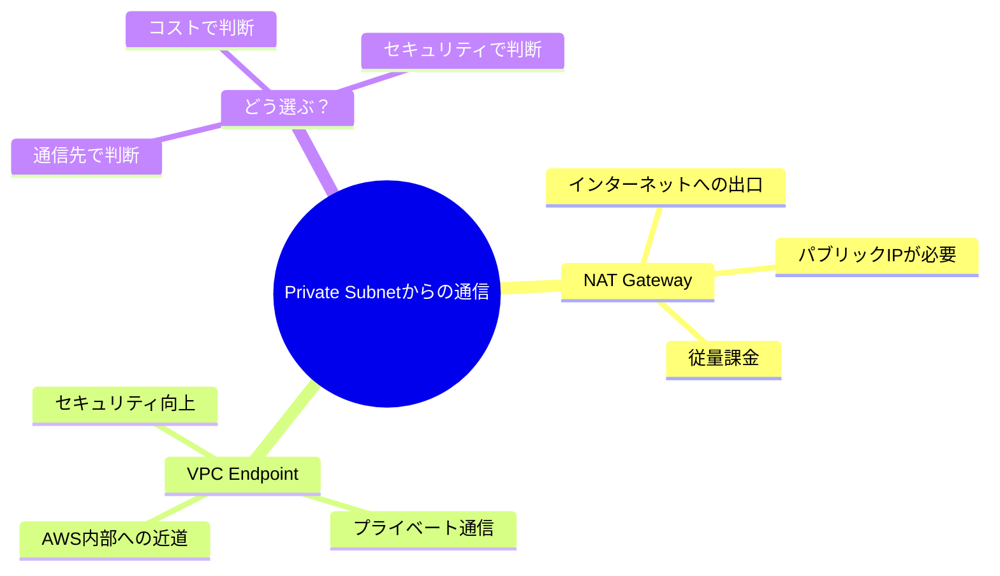
```mermaid
mindmap
  root((Private Subnetからの通信))
    NAT Gateway
      インターネットへの出口
      パブリックIPが必要
      従量課金
    VPC Endpoint
      AWS内部への近道
      プライベート通信
      セキュリティ向上
    どう選ぶ？
      通信先で判断
      コストで判断
      セキュリティで判断
```

## 第1章：まずはVPCの基本を理解しよう

VPCでのネットワーク通信を理解するために、まず基本的な構造を押さえましょう。

### VPCの基本構成

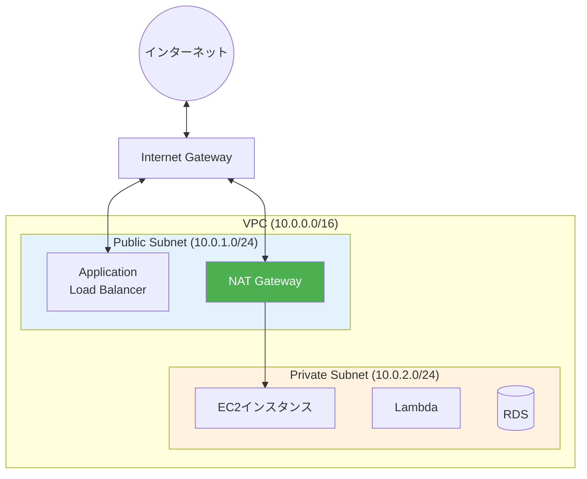
```mermaid
flowchart TB
    subgraph VPC["VPC (10.0.0.0/16)"]
        subgraph PublicSubnet["Public Subnet (10.0.1.0/24)"]
            ALB[Application<br>Load Balancer]
            NAT[NAT Gateway]
        end
        subgraph PrivateSubnet["Private Subnet (10.0.2.0/24)"]
            EC2[EC2インスタンス]
            Lambda[Lambda]
            RDS[(RDS)]
        end
    end

    Internet((インターネット))
    IGW[Internet Gateway]

    Internet <--> IGW
    IGW <--> ALB
    IGW <--> NAT
    NAT --> EC2

    style PublicSubnet fill:#e3f2fd
    style PrivateSubnet fill:#fff3e0
    style NAT fill:#4caf50,color:#fff
```

### Public SubnetとPrivate Subnetの違い

| 項目 | Public Subnet | Private Subnet |
|------|--------------|----------------|
| **インターネット接続** | 直接可能 | 直接不可 |
| **パブリックIP** | 割り当て可能 | なし |
| **配置するもの** | ALB、NAT Gateway | EC2、Lambda、RDS |
| **セキュリティ** | 露出あり | 隔離されている |

:::tip なぜPrivate Subnetを使うの？
データベースやアプリケーションサーバーをインターネットから隔離することで、**攻撃対象を減らし**、**セキュリティを向上**させます。でも、Private Subnetからも外部と通信したい場面は多々あります。
:::

### Private Subnetからの通信の課題

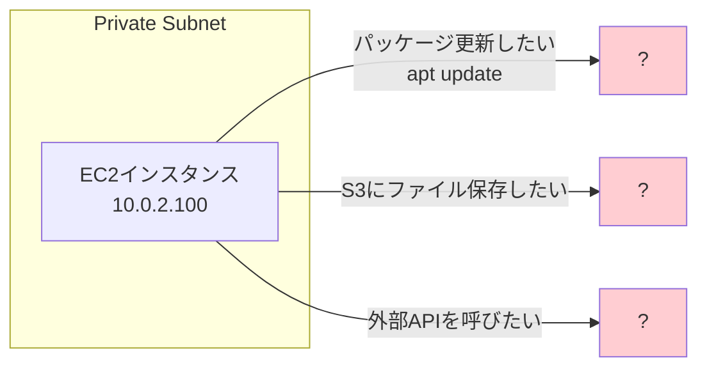
```mermaid
flowchart LR
    subgraph PrivateSubnet["Private Subnet"]
        EC2[EC2インスタンス<br>10.0.2.100]
    end

    EC2 -->|"パッケージ更新したい<br>apt update"| Q1["?"]
    EC2 -->|"S3にファイル保存したい"| Q2["?"]
    EC2 -->|"外部APIを呼びたい"| Q3["?"]

    style Q1 fill:#ffcdd2
    style Q2 fill:#ffcdd2
    style Q3 fill:#ffcdd2
```

Private SubnetにはパブリックIPがないので、そのままではどこにも通信できません。ここで登場するのが**NAT Gateway**と**VPC Endpoint**です！

## 第2章：NAT Gateway - 高速道路のたとえ

### NAT Gatewayとは

:::tip 高速道路のたとえ
Private Subnetを**住宅街**、インターネットを**他の都市**と考えてください。

- **Internet Gateway** = 都市間をつなぐ**高速道路の入口**
- **NAT Gateway** = 住宅街から高速道路に出るための**料金所付きインターチェンジ**

住宅街（Private Subnet）から他の都市（インターネット）に行くには、料金所（NAT Gateway）を通って高速道路（Internet Gateway）に乗る必要があります。
:::

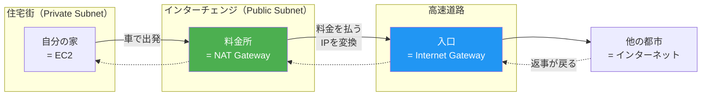
```mermaid
flowchart LR
    subgraph 住宅街["住宅街（Private Subnet）"]
        House[自分の家<br>= EC2]
    end

    subgraph IC["インターチェンジ（Public Subnet）"]
        Toll[料金所<br>= NAT Gateway]
    end

    subgraph Highway["高速道路"]
        IGW[入口<br>= Internet Gateway]
    end

    City["他の都市<br>= インターネット"]

    House -->|車で出発| Toll
    Toll -->|料金を払う<br>IPを変換| IGW
    IGW --> City
    City -.->|返事が戻る| IGW
    IGW -.-> Toll
    Toll -.-> House

    style Toll fill:#4caf50,color:#fff
    style IGW fill:#2196f3,color:#fff
```

### NAT Gatewayの仕組み

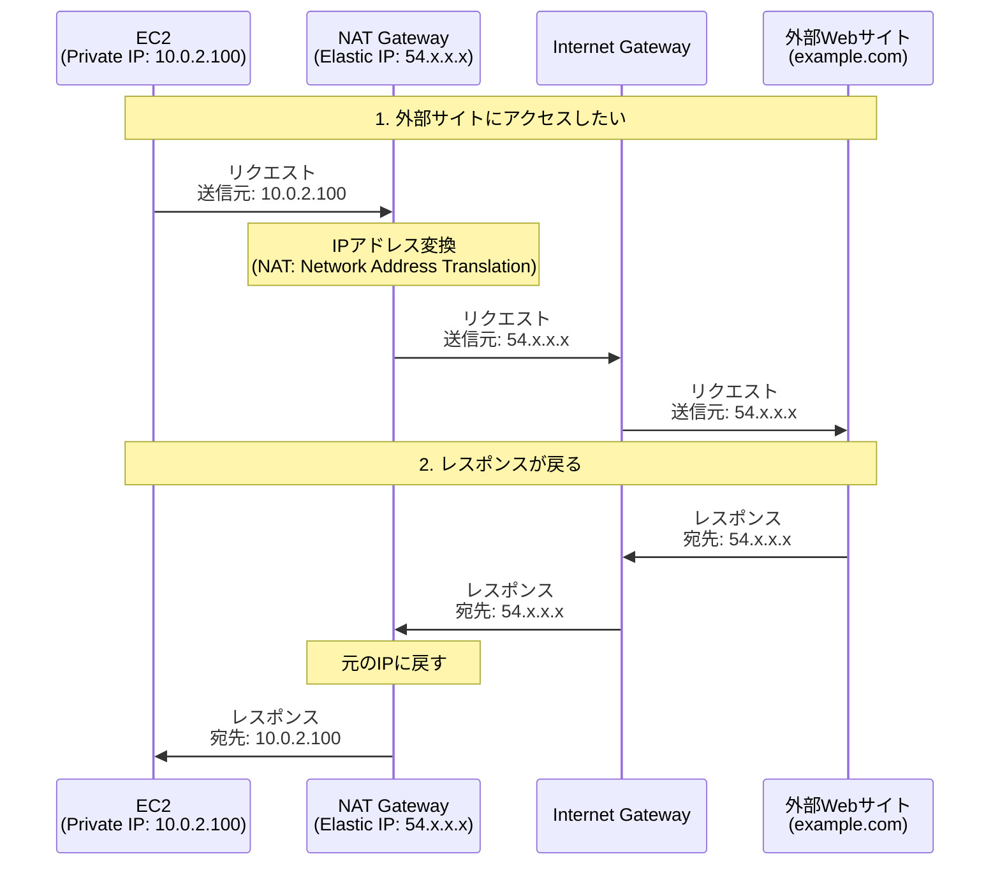
```mermaid
sequenceDiagram
    participant EC2 as EC2<br>(Private IP: 10.0.2.100)
    participant NAT as NAT Gateway<br>(Elastic IP: 54.x.x.x)
    participant IGW as Internet Gateway
    participant Web as 外部Webサイト<br>(example.com)

    Note over EC2,Web: 1. 外部サイトにアクセスしたい
    EC2->>NAT: リクエスト<br>送信元: 10.0.2.100

    Note over NAT: IPアドレス変換<br>(NAT: Network Address Translation)
    NAT->>IGW: リクエスト<br>送信元: 54.x.x.x
    IGW->>Web: リクエスト<br>送信元: 54.x.x.x

    Note over EC2,Web: 2. レスポンスが戻る
    Web->>IGW: レスポンス<br>宛先: 54.x.x.x
    IGW->>NAT: レスポンス<br>宛先: 54.x.x.x

    Note over NAT: 元のIPに戻す
    NAT->>EC2: レスポンス<br>宛先: 10.0.2.100
```

### NAT Gatewayの特徴

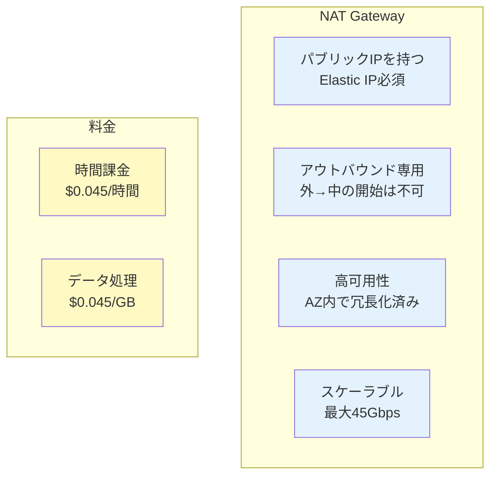
```mermaid
flowchart TB
    subgraph NAT Gateway
        A[パブリックIPを持つ<br>Elastic IP必須]
        B[アウトバウンド専用<br>外→中の開始は不可]
        C[高可用性<br>AZ内で冗長化済み]
        D[スケーラブル<br>最大45Gbps]
    end

    subgraph 料金
        E[時間課金<br>$0.045/時間]
        F[データ処理<br>$0.045/GB]
    end

    style A fill:#e3f2fd
    style B fill:#e3f2fd
    style C fill:#e3f2fd
    style D fill:#e3f2fd
    style E fill:#fff9c4
    style F fill:#fff9c4
```

### NAT Gatewayのユースケース

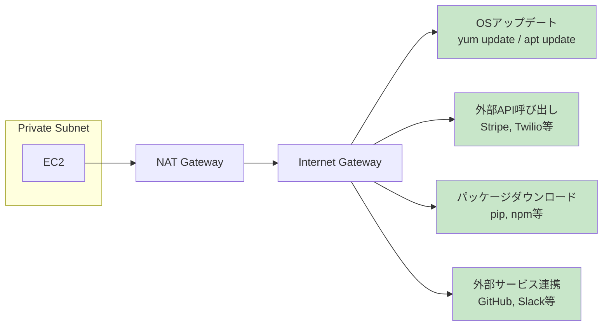
```mermaid
flowchart LR
    subgraph PrivateSubnet["Private Subnet"]
        EC2[EC2]
    end

    NAT[NAT Gateway]
    IGW[Internet Gateway]

    EC2 --> NAT --> IGW

    IGW --> U1["OSアップデート<br>yum update / apt update"]
    IGW --> U2["外部API呼び出し<br>Stripe, Twilio等"]
    IGW --> U3["パッケージダウンロード<br>pip, npm等"]
    IGW --> U4["外部サービス連携<br>GitHub, Slack等"]

    style U1 fill:#c8e6c9
    style U2 fill:#c8e6c9
    style U3 fill:#c8e6c9
    style U4 fill:#c8e6c9
```

## 第3章：VPC Endpoint - 専用トンネルのたとえ

### VPC Endpointとは

:::tip 専用トンネルのたとえ
もし、あなたが頻繁に行く場所が決まっているなら、**高速道路を使わなくても専用トンネル**を掘れます。

- **VPC Endpoint** = 住宅街から特定の場所への**専用トンネル**
- 料金所（NAT Gateway）も高速道路（Internet Gateway）も通らない
- **直接つながる**のでセキュリティも高い！
:::

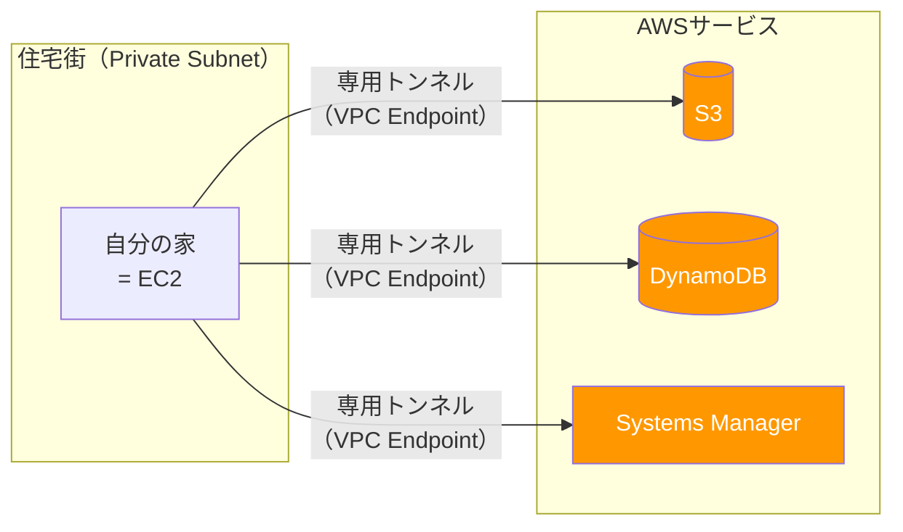
```mermaid
flowchart LR
    subgraph 住宅街["住宅街（Private Subnet）"]
        House[自分の家<br>= EC2]
    end

    subgraph AWS["AWSサービス"]
        S3[(S3)]
        DynamoDB[(DynamoDB)]
        SSM[Systems Manager]
    end

    House -->|"専用トンネル<br>（VPC Endpoint）"| S3
    House -->|"専用トンネル<br>（VPC Endpoint）"| DynamoDB
    House -->|"専用トンネル<br>（VPC Endpoint）"| SSM

    style S3 fill:#ff9800,color:#fff
    style DynamoDB fill:#ff9800,color:#fff
    style SSM fill:#ff9800,color:#fff
```

### 2種類のVPC Endpoint

VPC Endpointには**Gateway型**と**Interface型**の2種類があります。

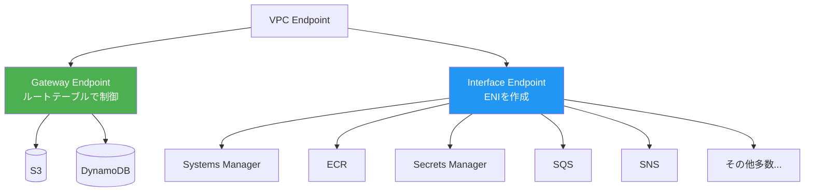
```mermaid
flowchart TB
    VPCEndpoint[VPC Endpoint]

    VPCEndpoint --> Gateway[Gateway Endpoint<br>ルートテーブルで制御]
    VPCEndpoint --> Interface[Interface Endpoint<br>ENIを作成]

    Gateway --> S3[(S3)]
    Gateway --> DynamoDB[(DynamoDB)]

    Interface --> SSM[Systems Manager]
    Interface --> ECR[ECR]
    Interface --> Secrets[Secrets Manager]
    Interface --> SQS[SQS]
    Interface --> SNS[SNS]
    Interface --> Other[その他多数...]

    style Gateway fill:#4caf50,color:#fff
    style Interface fill:#2196f3,color:#fff
```

### Gateway Endpoint（S3、DynamoDB用）

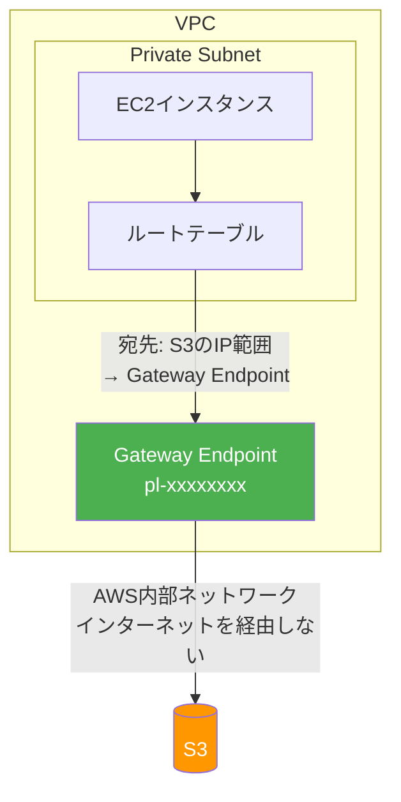
```mermaid
flowchart TB
    subgraph VPC["VPC"]
        subgraph PrivateSubnet["Private Subnet"]
            EC2[EC2インスタンス]
            RT[ルートテーブル]
        end

        GW[Gateway Endpoint<br>pl-xxxxxxxx]
    end

    S3[(S3)]

    EC2 --> RT
    RT -->|"宛先: S3のIP範囲<br>→ Gateway Endpoint"| GW
    GW -->|"AWS内部ネットワーク<br>インターネットを経由しない"| S3

    style GW fill:#4caf50,color:#fff
    style S3 fill:#ff9800,color:#fff
```

**Gateway Endpointの特徴：**

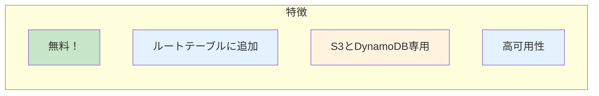
```mermaid
flowchart LR
    subgraph 特徴
        A[無料！]
        B[ルートテーブルに追加]
        C[S3とDynamoDB専用]
        D[高可用性]
    end

    style A fill:#c8e6c9
    style B fill:#e3f2fd
    style C fill:#fff3e0
    style D fill:#e3f2fd
```

### Interface Endpoint（PrivateLink）

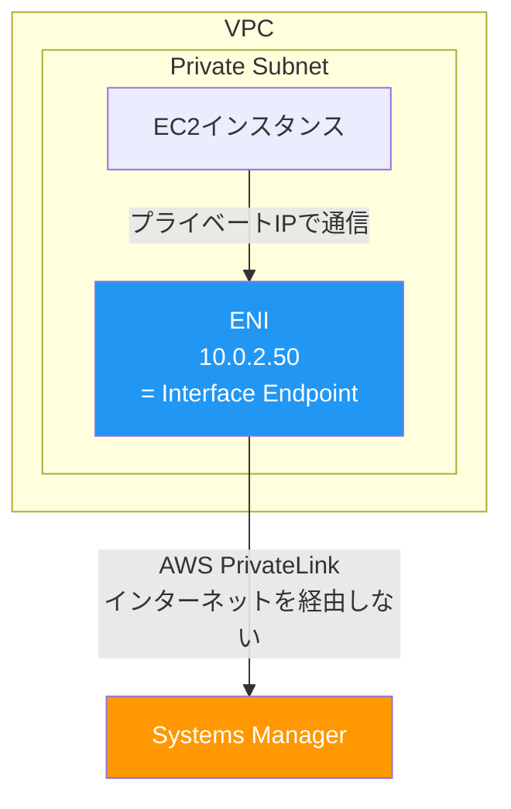
```mermaid
flowchart TB
    subgraph VPC["VPC"]
        subgraph PrivateSubnet["Private Subnet"]
            EC2[EC2インスタンス]
            ENI[ENI<br>10.0.2.50<br>= Interface Endpoint]
        end
    end

    SSM[Systems Manager]

    EC2 -->|"プライベートIPで通信"| ENI
    ENI -->|"AWS PrivateLink<br>インターネットを経由しない"| SSM

    style ENI fill:#2196f3,color:#fff
    style SSM fill:#ff9800,color:#fff
```

**Interface Endpointの特徴：**

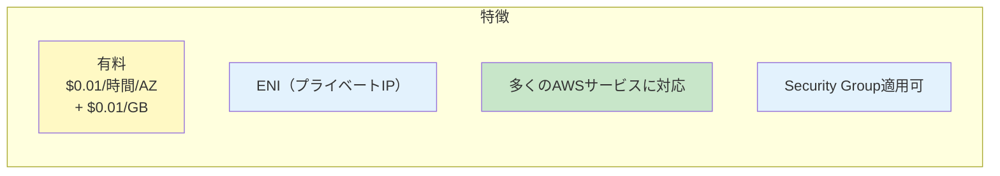
```mermaid
flowchart LR
    subgraph 特徴
        A[有料<br>$0.01/時間/AZ<br>+ $0.01/GB]
        B[ENI（プライベートIP）]
        C[多くのAWSサービスに対応]
        D[Security Group適用可]
    end

    style A fill:#fff9c4
    style B fill:#e3f2fd
    style C fill:#c8e6c9
    style D fill:#e3f2fd
```

### VPC Endpointの通信フロー

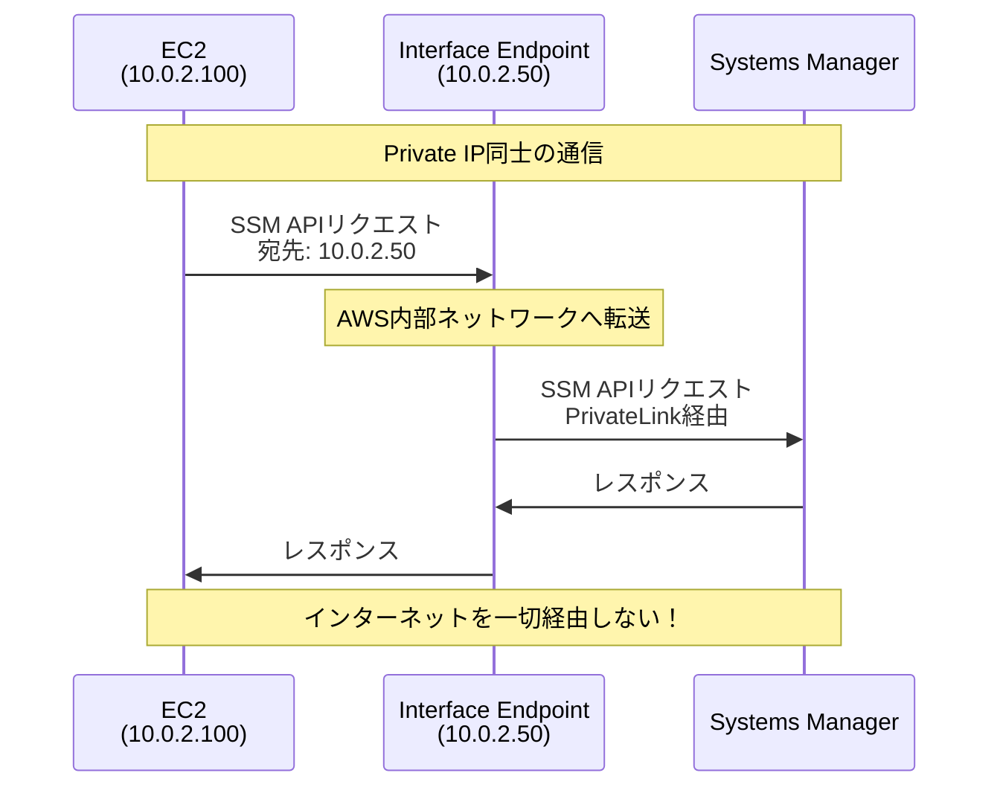
```mermaid
sequenceDiagram
    participant EC2 as EC2<br>(10.0.2.100)
    participant EP as Interface Endpoint<br>(10.0.2.50)
    participant SSM as Systems Manager

    Note over EC2,SSM: Private IP同士の通信
    EC2->>EP: SSM APIリクエスト<br>宛先: 10.0.2.50

    Note over EP: AWS内部ネットワークへ転送
    EP->>SSM: SSM APIリクエスト<br>PrivateLink経由

    SSM->>EP: レスポンス
    EP->>EC2: レスポンス

    Note over EC2,SSM: インターネットを一切経由しない！
```

## 第4章：NAT Gateway vs VPC Endpoint - どちらを選ぶ？

### 高速道路と専用トンネルの比較

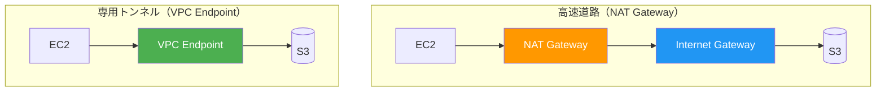
```mermaid
flowchart TB
    subgraph 高速道路ルート["高速道路（NAT Gateway）"]
        EC2_1[EC2] --> NAT[NAT Gateway] --> IGW[Internet Gateway] --> S3_1[(S3)]
    end

    subgraph 専用トンネル["専用トンネル（VPC Endpoint）"]
        EC2_2[EC2] --> EP[VPC Endpoint] --> S3_2[(S3)]
    end

    style NAT fill:#ff9800,color:#fff
    style IGW fill:#2196f3,color:#fff
    style EP fill:#4caf50,color:#fff
```

### 比較表

| 項目 | NAT Gateway | Gateway Endpoint | Interface Endpoint |
|------|-------------|------------------|-------------------|
| **対象** | インターネット全般 | S3, DynamoDB | 多数のAWSサービス |
| **時間課金** | $0.045/時間 | **無料** | $0.01/時間/AZ |
| **データ転送** | $0.045/GB | **無料** | $0.01/GB |
| **経路** | インターネット経由 | AWS内部 | AWS内部 |
| **セキュリティ** | パブリックIP露出 | 完全プライベート | 完全プライベート |
| **設定** | ルートテーブル | ルートテーブル | ENI + DNS |

### 選択のフローチャート

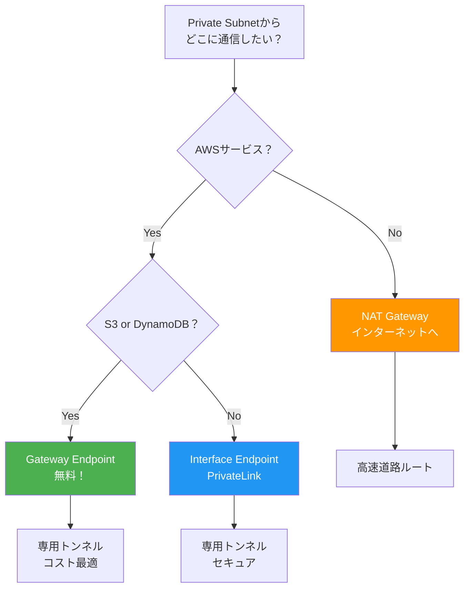
```mermaid
flowchart TD
    Start[Private Subnetから<br>どこに通信したい？]

    Start --> Q1{AWSサービス？}

    Q1 -->|No| NAT[NAT Gateway<br>インターネットへ]
    Q1 -->|Yes| Q2{S3 or DynamoDB？}

    Q2 -->|Yes| Gateway[Gateway Endpoint<br>無料！]
    Q2 -->|No| Interface[Interface Endpoint<br>PrivateLink]

    NAT --> End1[高速道路ルート]
    Gateway --> End2[専用トンネル<br>コスト最適]
    Interface --> End3[専用トンネル<br>セキュア]

    style NAT fill:#ff9800,color:#fff
    style Gateway fill:#4caf50,color:#fff
    style Interface fill:#2196f3,color:#fff
```

### コスト比較シミュレーション

月間1TBのS3通信がある場合：

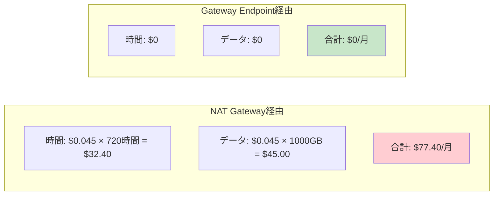
```mermaid
flowchart LR
    subgraph NAT["NAT Gateway経由"]
        N1["時間: $0.045 × 720時間 = $32.40"]
        N2["データ: $0.045 × 1000GB = $45.00"]
        N3["合計: $77.40/月"]
    end

    subgraph GW["Gateway Endpoint経由"]
        G1["時間: $0"]
        G2["データ: $0"]
        G3["合計: $0/月"]
    end

    style N3 fill:#ffcdd2
    style G3 fill:#c8e6c9
```

:::warning コスト削減のポイント
S3やDynamoDBへのアクセスが多い場合、**Gateway Endpointに切り替えるだけで大幅なコスト削減**が可能です！
:::

## 第5章：アーキテクチャパターン

### パターン1：基本構成

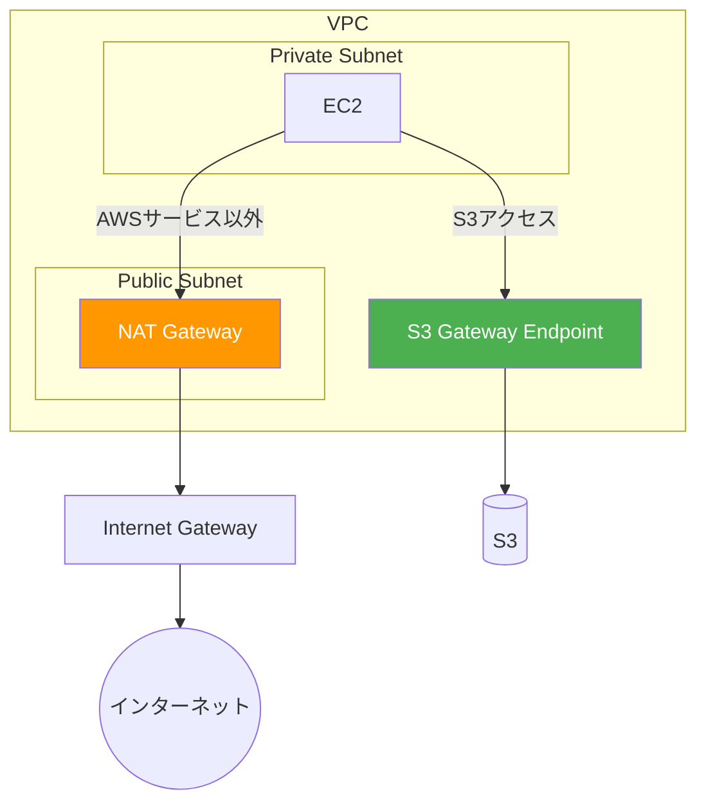
```mermaid
flowchart TB
    subgraph VPC["VPC"]
        subgraph PublicSubnet["Public Subnet"]
            NAT[NAT Gateway]
        end

        subgraph PrivateSubnet["Private Subnet"]
            EC2[EC2]
        end

        S3EP[S3 Gateway Endpoint]
    end

    IGW[Internet Gateway]
    S3[(S3)]
    Internet((インターネット))

    EC2 -->|"AWSサービス以外"| NAT
    NAT --> IGW --> Internet

    EC2 -->|"S3アクセス"| S3EP --> S3

    style NAT fill:#ff9800,color:#fff
    style S3EP fill:#4caf50,color:#fff
```

### パターン2：完全プライベート構成

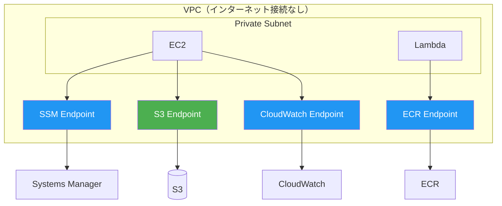
```mermaid
flowchart TB
    subgraph VPC["VPC（インターネット接続なし）"]
        subgraph PrivateSubnet["Private Subnet"]
            EC2[EC2]
            Lambda[Lambda]
        end

        SSM_EP[SSM Endpoint]
        ECR_EP[ECR Endpoint]
        S3_EP[S3 Endpoint]
        CW_EP[CloudWatch Endpoint]
    end

    SSM[Systems Manager]
    ECR[ECR]
    S3[(S3)]
    CW[CloudWatch]

    EC2 --> SSM_EP --> SSM
    Lambda --> ECR_EP --> ECR
    EC2 --> S3_EP --> S3
    EC2 --> CW_EP --> CW

    style SSM_EP fill:#2196f3,color:#fff
    style ECR_EP fill:#2196f3,color:#fff
    style S3_EP fill:#4caf50,color:#fff
    style CW_EP fill:#2196f3,color:#fff
```

:::info セキュリティが厳しい環境向け
金融機関や医療機関など、インターネット接続を完全に禁止したい場合は、**NAT Gatewayを使わず、必要なAWSサービスすべてにVPC Endpointを設定**します。
:::

### パターン3：ハイブリッド構成

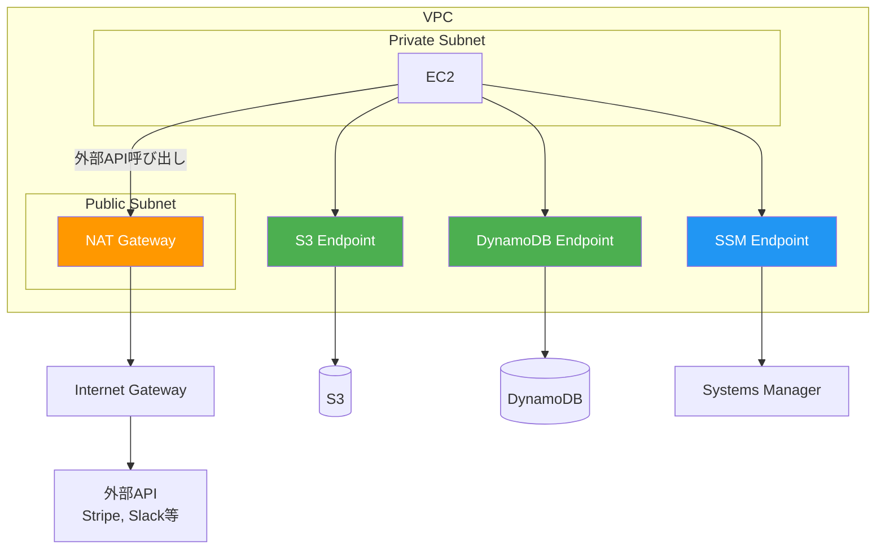
```mermaid
flowchart TB
    subgraph VPC["VPC"]
        subgraph PublicSubnet["Public Subnet"]
            NAT[NAT Gateway]
        end

        subgraph PrivateSubnet["Private Subnet"]
            EC2[EC2]
        end

        S3_EP[S3 Endpoint]
        DDB_EP[DynamoDB Endpoint]
        SSM_EP[SSM Endpoint]
    end

    IGW[Internet Gateway]

    S3[(S3)]
    DDB[(DynamoDB)]
    SSM[Systems Manager]

    External["外部API<br>Stripe, Slack等"]

    EC2 --> S3_EP --> S3
    EC2 --> DDB_EP --> DDB
    EC2 --> SSM_EP --> SSM

    EC2 -->|"外部API呼び出し"| NAT --> IGW --> External

    style NAT fill:#ff9800,color:#fff
    style S3_EP fill:#4caf50,color:#fff
    style DDB_EP fill:#4caf50,color:#fff
    style SSM_EP fill:#2196f3,color:#fff
```

## 第6章：実装例（Terraform）

### Gateway Endpoint（S3用）

```hcl
# VPCとサブネットは既存とする
data "aws_vpc" "main" {
  id = "vpc-xxxxxxxx"
}

data "aws_route_table" "private" {
  subnet_id = "subnet-xxxxxxxx"
}

# S3 Gateway Endpoint（無料！）
resource "aws_vpc_endpoint" "s3" {
  vpc_id            = data.aws_vpc.main.id
  service_name      = "com.amazonaws.ap-northeast-1.s3"
  vpc_endpoint_type = "Gateway"

  route_table_ids = [data.aws_route_table.private.id]

  tags = {
    Name = "s3-endpoint"
  }
}
```

### Interface Endpoint（Systems Manager用）

```hcl
# Security Groupの作成
resource "aws_security_group" "endpoint" {
  name        = "vpc-endpoint-sg"
  description = "Security group for VPC endpoints"
  vpc_id      = data.aws_vpc.main.id

  ingress {
    from_port   = 443
    to_port     = 443
    protocol    = "tcp"
    cidr_blocks = ["10.0.0.0/16"]  # VPC CIDR
  }

  tags = {
    Name = "vpc-endpoint-sg"
  }
}

# SSM Interface Endpoints（3つ必要）
resource "aws_vpc_endpoint" "ssm" {
  vpc_id              = data.aws_vpc.main.id
  service_name        = "com.amazonaws.ap-northeast-1.ssm"
  vpc_endpoint_type   = "Interface"
  subnet_ids          = ["subnet-xxxxxxxx"]
  security_group_ids  = [aws_security_group.endpoint.id]
  private_dns_enabled = true

  tags = {
    Name = "ssm-endpoint"
  }
}

resource "aws_vpc_endpoint" "ssmmessages" {
  vpc_id              = data.aws_vpc.main.id
  service_name        = "com.amazonaws.ap-northeast-1.ssmmessages"
  vpc_endpoint_type   = "Interface"
  subnet_ids          = ["subnet-xxxxxxxx"]
  security_group_ids  = [aws_security_group.endpoint.id]
  private_dns_enabled = true

  tags = {
    Name = "ssmmessages-endpoint"
  }
}

resource "aws_vpc_endpoint" "ec2messages" {
  vpc_id              = data.aws_vpc.main.id
  service_name        = "com.amazonaws.ap-northeast-1.ec2messages"
  vpc_endpoint_type   = "Interface"
  subnet_ids          = ["subnet-xxxxxxxx"]
  security_group_ids  = [aws_security_group.endpoint.id]
  private_dns_enabled = true

  tags = {
    Name = "ec2messages-endpoint"
  }
}
```

### NAT Gateway

```hcl
# Elastic IPの作成
resource "aws_eip" "nat" {
  domain = "vpc"

  tags = {
    Name = "nat-gateway-eip"
  }
}

# NAT Gatewayの作成
resource "aws_nat_gateway" "main" {
  allocation_id = aws_eip.nat.id
  subnet_id     = "subnet-public-xxxxxxxx"  # Public Subnetに配置

  tags = {
    Name = "main-nat-gateway"
  }
}

# Private Subnetのルートテーブル更新
resource "aws_route" "private_nat" {
  route_table_id         = "rtb-private-xxxxxxxx"
  destination_cidr_block = "0.0.0.0/0"
  nat_gateway_id         = aws_nat_gateway.main.id
}
```

## 第7章：よくある質問（FAQ）

### Q1: NAT GatewayとNAT Instanceの違いは？

```mermaid
flowchart TB
    subgraph NAT_Gateway["NAT Gateway（推奨）"]
        G1[マネージドサービス]
        G2[自動スケーリング]
        G3[高可用性]
        G4[メンテナンス不要]
    end

    subgraph NAT_Instance["NAT Instance"]
        I1[EC2インスタンス]
        I2[手動スケーリング]
        I3[自分で冗長化]
        I4[パッチ適用必要]
    end

    style G1 fill:#c8e6c9
    style G2 fill:#c8e6c9
    style G3 fill:#c8e6c9
    style G4 fill:#c8e6c9
    style I1 fill:#fff9c4
    style I2 fill:#fff9c4
    style I3 fill:#fff9c4
    style I4 fill:#fff9c4
```

:::tip 結論
特別な理由がない限り、**NAT Gateway**を使いましょう。NAT Instanceは過去の遺物です。
:::

### Q2: 複数AZでNAT Gatewayは必要？

```mermaid
flowchart TB
    subgraph 高可用性構成
        subgraph AZ_A["AZ-a"]
            NAT_A[NAT Gateway A]
            Private_A[Private Subnet A]
        end

        subgraph AZ_C["AZ-c"]
            NAT_C[NAT Gateway C]
            Private_C[Private Subnet C]
        end
    end

    Private_A -->|"AZ-a内で完結"| NAT_A
    Private_C -->|"AZ-c内で完結"| NAT_C

    style NAT_A fill:#4caf50,color:#fff
    style NAT_C fill:#4caf50,color:#fff
```

:::warning 推奨構成
本番環境では**各AZにNAT Gatewayを1つずつ配置**しましょう。AZ障害時も他のAZで通信を継続できます。
:::

### Q3: VPC Endpointのプライベートホストゾーンって何？

```mermaid
sequenceDiagram
    participant EC2
    participant DNS as Route 53 Resolver
    participant EP as Interface Endpoint<br>(10.0.2.50)
    participant SSM as Systems Manager

    Note over EC2,SSM: private_dns_enabled = true の場合

    EC2->>DNS: ssm.ap-northeast-1.amazonaws.com<br>のIPアドレスは？
    DNS->>EC2: 10.0.2.50<br>（Endpointのプライベート IP）

    EC2->>EP: SSMリクエスト（10.0.2.50宛）
    EP->>SSM: 転送

    Note over EC2,SSM: アプリのコード変更なしで<br>自動的にEndpoint経由になる！
```

### Q4: S3のGateway EndpointとInterface Endpoint、どっちを使う？

```mermaid
flowchart TB
    Q[S3アクセス]
    Q --> Q1{オンプレミスから<br>アクセスする？}

    Q1 -->|Yes| Interface[Interface Endpoint<br>Direct Connect/VPN経由可]
    Q1 -->|No| Gateway[Gateway Endpoint<br>無料！]

    style Gateway fill:#4caf50,color:#fff
    style Interface fill:#2196f3,color:#fff
```

## 第8章：トラブルシューティング

### 通信できない場合のチェックリスト

```mermaid
flowchart TD
    Start[通信できない] --> C1{セキュリティグループ<br>は正しい？}
    C1 -->|No| Fix1[アウトバウンド許可を確認]
    C1 -->|Yes| C2{ルートテーブル<br>は正しい？}

    C2 -->|No| Fix2[NAT/Endpointへのルート追加]
    C2 -->|Yes| C3{NACL<br>は正しい？}

    C3 -->|No| Fix3[NACL許可ルール確認]
    C3 -->|Yes| C4{DNS解決<br>できてる？}

    C4 -->|No| Fix4[VPC DNS設定確認<br>private_dns_enabled確認]
    C4 -->|Yes| C5{Endpoint Policy<br>は正しい？}

    C5 -->|No| Fix5[Endpoint Policyを修正]
    C5 -->|Yes| Support[AWSサポートに問い合わせ]

    style Fix1 fill:#fff9c4
    style Fix2 fill:#fff9c4
    style Fix3 fill:#fff9c4
    style Fix4 fill:#fff9c4
    style Fix5 fill:#fff9c4
```

### よくあるミス

| ミス | 症状 | 解決策 |
|------|------|--------|
| NAT GatewayをPrivate Subnetに配置 | 通信不可 | Public Subnetに移動 |
| Elastic IP未割り当て | NAT Gateway作成失敗 | EIPを割り当て |
| ルートテーブル未設定 | 通信不可 | 0.0.0.0/0 → NAT Gateway |
| Security Groupで443未許可 | Interface Endpoint通信不可 | インバウンド443許可 |
| private_dns_enabled = false | DNS解決失敗 | trueに変更 |

## まとめ

```mermaid
flowchart TB
    subgraph 覚えておくべきこと
        A[NAT Gateway<br>= 高速道路<br>インターネットへの出口]
        B[VPC Endpoint<br>= 専用トンネル<br>AWSサービスへの近道]
    end

    A --> A1[外部APIやパッケージ更新に使う]
    A --> A2[時間 + データ転送で課金]

    B --> B1[S3/DynamoDBはGateway型で無料！]
    B --> B2[その他はInterface型でセキュア]

    style A fill:#ff9800,color:#fff
    style B fill:#4caf50,color:#fff
    style A1 fill:#fff3e0
    style A2 fill:#fff3e0
    style B1 fill:#c8e6c9
    style B2 fill:#e3f2fd
```

### 選択の指針

| 通信先 | 推奨 | 理由 |
|--------|------|------|
| **S3** | Gateway Endpoint | 無料、高速 |
| **DynamoDB** | Gateway Endpoint | 無料、高速 |
| **SSM/ECR/Secrets Manager** | Interface Endpoint | セキュア |
| **外部API（Stripe等）** | NAT Gateway | インターネット経由必須 |
| **OSアップデート** | NAT Gateway | インターネット経由必須 |

### 最後に

:::info ポイント
1. **まずGateway Endpointを検討** - S3とDynamoDBは無料で使える
2. **AWSサービスはInterface Endpoint** - セキュリティ向上、コスト削減
3. **NAT Gatewayは最後の手段** - 本当にインターネットが必要な場合のみ
4. **コストを定期的に確認** - NAT Gatewayのデータ転送コストは意外と高い
:::

VPCのネットワーク設計は奥が深いですが、「高速道路と専用トンネル」のたとえで基本を押さえれば、適切な選択ができるようになります。

この記事が、あなたのAWSネットワーク設計の参考になれば幸いです！
